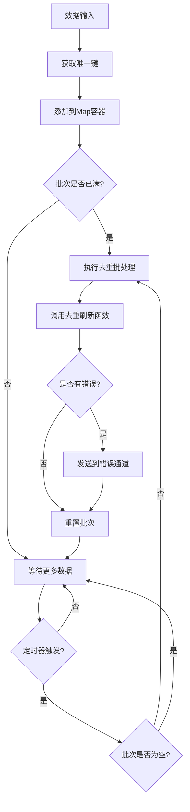

# 去重管道

去重管道（DeduplicationPipeline）是 Go Pipeline v2 的另一个核心组件，提供基于唯一键的去重批处理功能。

## 概述

去重管道在批处理过程中会自动去除重复数据，基于用户定义的唯一键函数来判断数据是否重复。适用于需要去重处理的数据场景。

## 核心特性

- **自动去重**: 基于唯一键自动去除重复数据
- **灵活的键函数**: 支持自定义唯一键生成逻辑
- **批处理机制**: 支持按大小和时间间隔自动触发批处理
- **并发安全**: 内置goroutine安全机制
- **错误处理**: 完善的错误收集和传播

## 数据流程



## 创建去重管道

### 使用默认配置

```go
pipeline := gopipeline.NewDefaultDeduplicationPipeline(
    // 唯一键函数
    func(data User) string {
        return data.Email // 使用邮箱作为唯一键
    },
    // 批处理函数
    func(ctx context.Context, batchData []User) error {
        fmt.Printf("处理去重后的 %d 个用户\n", len(batchData))
        return nil
    },
)
```

### 使用自定义配置

```go
deduplicationConfig := gopipeline.PipelineConfig{
    BufferSize:    200,                    // 缓冲区大小
    FlushSize:     50,                     // 批处理大小
    FlushInterval: time.Millisecond * 100, // 刷新间隔
}

pipeline := gopipeline.NewDeduplicationPipeline(deduplicationConfig,
    // 唯一键函数
    func(data Product) string {
        return fmt.Sprintf("%s-%s", data.SKU, data.Version)
    },
    // 批处理函数
    func(ctx context.Context, batchData []Product) error {
        return processProducts(batchData)
    },
)
```

## 使用示例

### 用户数据去重示例

```go
package main

import (
    "context"
    "fmt"
    "log"
    "time"
    
    gopipeline "github.com/rushairer/go-pipeline/v2"
)

type User struct {
    ID    int
    Name  string
    Email string
}

func main() {
    // 创建去重管道，基于邮箱去重
    pipeline := gopipeline.NewDefaultDeduplicationPipeline(
        func(user User) string {
            return user.Email // 邮箱作为唯一键
        },
        func(ctx context.Context, users []User) error {
            fmt.Printf("批处理 %d 个去重用户:\n", len(users))
            for _, user := range users {
                fmt.Printf("  - %s (%s)\n", user.Name, user.Email)
            }
            return nil
        },
    )
    
    ctx, cancel := context.WithTimeout(context.Background(), time.Second*5)
    defer cancel()
    
    // 启动异步处理
    go func() {
        if err := pipeline.AsyncPerform(ctx); err != nil {
            log.Printf("管道执行错误: %v", err)
        }
    }()
    
    // 监听错误
    errorChan := pipeline.ErrorChan(10)
    go func() {
        for err := range errorChan {
            log.Printf("处理错误: %v", err)
        }
    }()
    
    // 添加数据（包含重复邮箱）
    dataChan := pipeline.DataChan()
    users := []User{
        {ID: 1, Name: "Alice", Email: "alice@example.com"},
        {ID: 2, Name: "Bob", Email: "bob@example.com"},
        {ID: 3, Name: "Alice Updated", Email: "alice@example.com"}, // 重复邮箱
        {ID: 4, Name: "Charlie", Email: "charlie@example.com"},
        {ID: 5, Name: "Bob Updated", Email: "bob@example.com"},     // 重复邮箱
    }
    
    for _, user := range users {
        dataChan <- user
    }
    
    // 关闭数据通道
    close(dataChan)
    
    // 等待处理完成
    time.Sleep(time.Second * 2)
}
```

### 商品数据去重示例

```go
type Product struct {
    SKU     string
    Name    string
    Version string
    Price   float64
}

func productDeduplicationExample() {
    // 基于SKU+Version组合去重
    pipeline := gopipeline.NewDefaultDeduplicationPipeline(
        func(product Product) string {
            return fmt.Sprintf("%s-%s", product.SKU, product.Version)
        },
        func(ctx context.Context, products []Product) error {
            // 批量更新商品信息
            return updateProducts(products)
        },
    )
    
    // 使用管道...
}
```

### 日志去重示例

```go
type LogEntry struct {
    Timestamp time.Time
    Level     string
    Message   string
    Source    string
}

func logDeduplicationExample() {
    // 基于消息内容和来源去重
    pipeline := gopipeline.NewDefaultDeduplicationPipeline(
        func(log LogEntry) string {
            return fmt.Sprintf("%s-%s", log.Message, log.Source)
        },
        func(ctx context.Context, logs []LogEntry) error {
            // 批量写入日志
            return writeLogsToStorage(logs)
        },
    )
    
    // 使用管道...
}
```

## 唯一键函数设计

### 简单字段作为键

```go
// 使用单个字段
func(user User) string {
    return user.Email
}
```

### 组合字段作为键

```go
// 使用多个字段组合
func(order Order) string {
    return fmt.Sprintf("%s-%s-%d", 
        order.CustomerID, 
        order.ProductID, 
        order.Timestamp.Unix())
}
```

### 复杂逻辑键

```go
// 使用复杂逻辑生成键
func(event Event) string {
    // 标准化处理
    normalized := strings.ToLower(strings.TrimSpace(event.Name))
    return fmt.Sprintf("%s-%s", normalized, event.Category)
}
```

### 哈希键

```go
import (
    "crypto/md5"
    "fmt"
)

func(data ComplexData) string {
    // 对复杂数据生成哈希键
    content := fmt.Sprintf("%v", data)
    hash := md5.Sum([]byte(content))
    return fmt.Sprintf("%x", hash)
}
```

## 去重策略

### 保留最新数据

去重管道默认保留最后添加的数据：

```go
// 如果有重复键，后添加的数据会覆盖先添加的数据
dataChan <- User{ID: 1, Name: "Alice", Email: "alice@example.com"}
dataChan <- User{ID: 2, Name: "Alice Updated", Email: "alice@example.com"} // 这个会被保留
```

### 自定义去重逻辑

如果需要更复杂的去重逻辑，可以在批处理函数中实现：

```go
func(ctx context.Context, users []User) error {
    // 自定义去重逻辑：保留ID最小的用户
    userMap := make(map[string]User)
    for _, user := range users {
        if existing, exists := userMap[user.Email]; !exists || user.ID < existing.ID {
            userMap[user.Email] = user
        }
    }
    
    // 转换回切片
    deduplicatedUsers := make([]User, 0, len(userMap))
    for _, user := range userMap {
        deduplicatedUsers = append(deduplicatedUsers, user)
    }
    
    return processUsers(deduplicatedUsers)
}
```

## 性能考虑

### 内存使用

去重管道使用map存储数据，内存使用量与批次大小相关：

```go
// 较小的批次大小可以减少内存使用
memoryOptimizedConfig := gopipeline.PipelineConfig{
    BufferSize:    200,                   // 缓冲区大小
    FlushSize:     100,                   // 最多存储100个唯一项
    FlushInterval: time.Millisecond * 50, // 刷新间隔
}
```

### 键函数性能

确保唯一键函数高效：

```go
// 好的做法：简单字段访问
func(user User) string {
    return user.ID
}

// 避免：复杂计算
func(user User) string {
    // 避免在键函数中进行复杂计算
    return expensiveCalculation(user)
}
```

## 错误处理

```go
// 监听错误
errorChan := pipeline.ErrorChan(10)
go func() {
    for err := range errorChan {
        log.Printf("去重管道错误: %v", err)
        
        // 可以根据错误类型进行处理
        if isRetryableError(err) {
            // 重试逻辑
        }
    }
}()
```

## 最佳实践

1. **选择合适的唯一键**: 确保键能够准确标识数据的唯一性
2. **键函数要高效**: 避免在键函数中进行复杂计算
3. **监控内存使用**: 大批次可能导致较高的内存使用
4. **合理设置批次大小**: 平衡内存使用和处理效率
5. **及时消费错误通道**: 防止错误通道阻塞

## 与标准管道的对比

| 特性 | 标准管道 | 去重管道 |
|------|----------|----------|
| 数据顺序 | 保持原始顺序 | 不保证顺序 |
| 内存使用 | 较低 | 较高（需要存储map） |
| 处理速度 | 较快 | 较慢（需要去重计算） |
| 适用场景 | 普通批处理 | 需要去重的场景 |

## 下一步

- [配置指南](./configuration) - 详细的配置参数说明
- [API 参考](./api-reference) - 完整的API文档
- [标准管道](./standard-pipeline) - 标准管道使用指南