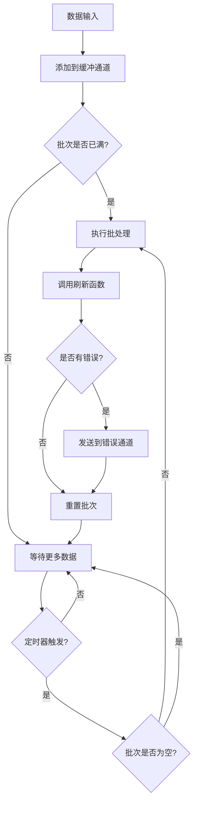

# 标准管道

标准管道（StandardPipeline）是 Go Pipeline v2 的核心组件之一，提供按顺序批处理数据的功能。

## 概述

标准管道将输入的数据按照配置的批次大小和时间间隔进行批处理，适用于需要保持数据顺序的场景。

## 核心特性

- **顺序处理**: 数据按照添加顺序进行批处理
- **自动批处理**: 支持按大小和时间间隔自动触发批处理
- **并发安全**: 内置goroutine安全机制
- **错误处理**: 完善的错误收集和传播

## 数据流程



## 创建标准管道

### 使用默认配置

```go
pipeline := gopipeline.NewDefaultStandardPipeline(
    func(ctx context.Context, batchData []string) error {
        // 处理批次数据
        fmt.Printf("处理 %d 条数据: %v\n", len(batchData), batchData)
        return nil
    },
)
```

### 使用自定义配置

```go
config := gopipeline.PipelineConfig{
    BufferSize:    200,                    // 缓冲区大小
    FlushSize:     100,                    // 批处理大小
    FlushInterval: time.Millisecond * 100, // 刷新间隔
}

pipeline := gopipeline.NewStandardPipeline(config,
    func(ctx context.Context, batchData []string) error {
        // 处理批次数据
        return processData(batchData)
    },
)
```

## 使用示例

### 基本用法

```go
package main

import (
    "context"
    "fmt"
    "log"
    "time"
    
    gopipeline "github.com/rushairer/go-pipeline/v2"
)

func main() {
    // 创建管道
    pipeline := gopipeline.NewDefaultStandardPipeline(
        func(ctx context.Context, batchData []string) error {
            fmt.Printf("批处理 %d 条数据: %v\n", len(batchData), batchData)
            // 模拟处理时间
            time.Sleep(time.Millisecond * 10)
            return nil
        },
    )
    
    ctx, cancel := context.WithTimeout(context.Background(), time.Second*5)
    defer cancel()
    
    // 启动异步处理
    go func() {
        if err := pipeline.AsyncPerform(ctx); err != nil {
            log.Printf("管道执行错误: %v", err)
        }
    }()
    
    // 监听错误
    errorChan := pipeline.ErrorChan(10)
    go func() {
        for err := range errorChan {
            log.Printf("处理错误: %v", err)
        }
    }()
    
    // 添加数据
    dataChan := pipeline.DataChan()
    for i := 0; i < 200; i++ {
        dataChan <- fmt.Sprintf("data-%d", i)
    }
    
    // 关闭数据通道
    close(dataChan)
    
    // 等待处理完成
    time.Sleep(time.Second * 2)
}
```

### 数据库批量插入示例

```go
func batchInsertExample() {
    // 创建数据库批量插入管道
    pipeline := gopipeline.NewDefaultStandardPipeline(
        func(ctx context.Context, users []User) error {
            // 批量插入数据库
            return db.CreateInBatches(users, len(users)).Error
        },
    )
    
    ctx := context.Background()
    
    // 启动管道
    go pipeline.AsyncPerform(ctx)
    
    // 错误处理
    go func() {
        for err := range pipeline.ErrorChan(10) {
            log.Printf("数据库插入错误: %v", err)
        }
    }()
    
    // 添加用户数据
    dataChan := pipeline.DataChan()
    for i := 0; i < 1000; i++ {
        user := User{
            Name:  fmt.Sprintf("user-%d", i),
            Email: fmt.Sprintf("user%d@example.com", i),
        }
        dataChan <- user
    }
    
    close(dataChan)
}
```

### API 调用批处理示例

```go
func apiCallExample() {
    pipeline := gopipeline.NewStandardPipeline(
        gopipeline.PipelineConfig{
            FlushSize:     20,                     // 每次调用20条数据
            FlushInterval: time.Millisecond * 200, // 200ms间隔
        },
        func(ctx context.Context, requests []APIRequest) error {
            // 批量调用API
            return batchCallAPI(requests)
        },
    )
    
    // 使用管道...
}
```

## 同步 vs 异步执行

### 异步执行（推荐）

```go
// 异步执行，不阻塞主线程
go func() {
    if err := pipeline.AsyncPerform(ctx); err != nil {
        log.Printf("管道执行错误: %v", err)
    }
}()
```

### 同步执行

```go
// 同步执行，阻塞直到完成或取消
if err := pipeline.SyncPerform(ctx); err != nil {
    log.Printf("管道执行错误: %v", err)
}
```

## 错误处理

标准管道提供完善的错误处理机制：

```go
// 创建错误通道
errorChan := pipeline.ErrorChan(100) // 缓冲区大小为100

// 监听错误
go func() {
    for err := range errorChan {
        // 处理错误
        log.Printf("批处理错误: %v", err)
        
        // 可以根据错误类型进行不同处理
        switch e := err.(type) {
        case *DatabaseError:
            // 数据库错误处理
        case *NetworkError:
            // 网络错误处理
        default:
            // 其他错误处理
        }
    }
}()
```

## 性能优化建议

### 1. 合理设置批次大小

```go
// 根据处理能力调整批次大小
config := gopipeline.PipelineConfig{
    FlushSize: 100, // 较大的批次可以提高吞吐量
}
```

### 2. 调整缓冲区大小

```go
// 缓冲区应该至少是批次大小的2倍
config := gopipeline.PipelineConfig{
    BufferSize: 200, // FlushSize * 2
    FlushSize:  100,
}
```

### 3. 优化刷新间隔

```go
// 根据延迟要求调整间隔
config := gopipeline.PipelineConfig{
    FlushInterval: time.Millisecond * 50, // 低延迟
    // 或
    FlushInterval: time.Second, // 高吞吐量
}
```

## 最佳实践

1. **及时消费错误通道**: 必须有goroutine消费错误通道，否则可能导致阻塞
2. **正确关闭通道**: 使用"谁写谁关闭"原则管理通道生命周期
3. **合理设置超时**: 使用context控制管道执行时间
4. **监控性能**: 根据实际场景调整配置参数

## 下一步

- [去重管道](./deduplication-pipeline) - 了解去重批处理管道
- [配置指南](./configuration) - 详细的配置参数说明
- [API 参考](./api-reference) - 完整的API文档