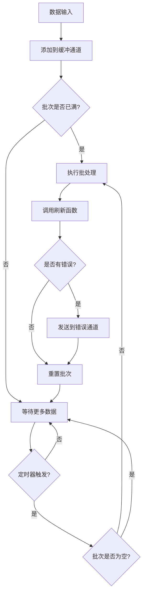

# 标准管道

标准管道（StandardPipeline）是 Go Pipeline v2 的核心组件之一，提供按顺序批处理数据的功能。

## 概述

标准管道将输入的数据按照配置的批次大小和时间间隔进行批处理，适用于需要保持数据顺序的场景。

## 核心特性

- **顺序处理**: 数据按照添加顺序进行批处理
- **自动批处理**: 支持按大小和时间间隔自动触发批处理
- **并发安全**: 内置goroutine安全机制
- **错误处理**: 完善的错误收集和传播

## 数据流程


```mermaid
graph TD
    A[数据输入] --> B[添加到缓冲通道]
    B --> C{批次是否已满?}
    C -->|是| D[执行批处理]
    C -->|否| E[等待更多数据]
    E --> F{定时器触发?}
    F -->|是| G{批次是否为空?}
    G -->|否| D
    G -->|是| E
    F -->|否| E
    D --> H[调用刷新函数]
    H --> I{是否有错误?}
    I -->|是| J[发送到错误通道]
    I -->|否| K[重置批次]
    J --> K
    K --> E
```

## 创建标准管道

### 使用默认配置

```go
pipeline := gopipeline.NewDefaultStandardPipeline(
    func(ctx context.Context, batchData []string) error {
        // 处理批次数据
        fmt.Printf("处理 %d 条数据: %v\n", len(batchData), batchData)
        return nil
    },
)
```

### 使用自定义配置

```go
// 使用链式方法创建配置
customConfig := gopipeline.NewPipelineConfig().
    WithBufferSize(200).
    WithFlushSize(100).
    WithFlushInterval(time.Millisecond * 100).
    WithDrainOnCancel(true).
    WithDrainGracePeriod(150 * time.Millisecond)

pipeline := gopipeline.NewStandardPipeline(customConfig,
    func(ctx context.Context, batchData []string) error {
        // 处理批次数据
        return processData(batchData)
    },
)
```

## 使用示例

### 使用便捷API（推荐）

```go
package main

import (
    "context"
    "fmt"
    "log"
    "time"
    
    gopipeline "github.com/rushairer/go-pipeline/v2"
)

func main() {
    // 创建管道
    pipeline := gopipeline.NewDefaultStandardPipeline(
        func(ctx context.Context, batchData []string) error {
            fmt.Printf("批处理 %d 条数据: %v\n", len(batchData), batchData)
            // 模拟处理时间
            time.Sleep(time.Millisecond * 10)
            return nil
        },
    )
    
    ctx, cancel := context.WithTimeout(context.Background(), time.Second*5)
    defer cancel()
    
    // 使用便捷API启动
    done, errs := pipeline.Start(ctx)
    
    // 监听错误
    go func() {
        for err := range errs {
            log.Printf("处理错误: %v", err)
        }
    }()
    
    // 添加数据
    dataChan := pipeline.DataChan()
    go func() {
        defer close(dataChan) // 谁写谁关闭
        for i := 0; i < 200; i++ {
            select {
            case dataChan <- fmt.Sprintf("data-%d", i):
            case <-ctx.Done():
                return
            }
        }
    }()
    
    // 等待处理完成
    <-done
}
```

### 同步运行示例

```go
func syncExample() {
    pipeline := gopipeline.NewDefaultStandardPipeline(
        func(ctx context.Context, batchData []string) error {
            fmt.Printf("批处理 %d 条数据: %v\n", len(batchData), batchData)
            return nil
        },
    )
    
    ctx, cancel := context.WithTimeout(context.Background(), time.Second*5)
    defer cancel()
    
    // 同步运行，设置错误通道容量为128
    if err := pipeline.Run(ctx, 128); err != nil {
        log.Printf("管道执行错误: %v", err)
    }
}
```

### 数据库批量插入示例

```go
func batchInsertExample() {
    // 创建数据库批量插入管道
    pipeline := gopipeline.NewDefaultStandardPipeline(
        func(ctx context.Context, users []User) error {
            // 批量插入数据库
            return db.CreateInBatches(users, len(users)).Error
        },
    )
    
    ctx := context.Background()
    
    // 启动管道
    go pipeline.AsyncPerform(ctx)
    
    // 错误处理
    go func() {
        for err := range pipeline.ErrorChan(10) {
            log.Printf("数据库插入错误: %v", err)
        }
    }()
    
    // 添加用户数据
    dataChan := pipeline.DataChan()
    for i := 0; i < 1000; i++ {
        user := User{
            Name:  fmt.Sprintf("user-%d", i),
            Email: fmt.Sprintf("user%d@example.com", i),
        }
        dataChan <- user
    }
    
    close(dataChan)
}
```

### API 调用批处理示例

```go
func apiCallExample() {
    pipeline := gopipeline.NewStandardPipeline(
        gopipeline.PipelineConfig{
            FlushSize:     20,                     // 每次调用20条数据
            FlushInterval: time.Millisecond * 200, // 200ms间隔
        },
        func(ctx context.Context, requests []APIRequest) error {
            // 批量调用API
            return batchCallAPI(requests)
        },
    )
    
    // 使用管道...
}
```

## 便捷API vs 传统API

### 便捷API（推荐）

v2.2.2 新增的便捷API，减少样板代码：

```go
// 异步启动
done, errs := pipeline.Start(ctx)
go func() {
    for err := range errs {
        log.Printf("错误: %v", err)
    }
}()
<-done // 等待完成

// 同步运行
if err := pipeline.Run(ctx, 128); err != nil {
    log.Printf("管道执行错误: %v", err)
}
```

### 传统API

```go
// 异步执行
go func() {
    if err := pipeline.AsyncPerform(ctx); err != nil {
        log.Printf("管道执行错误: %v", err)
    }
}()

// 同步执行
if err := pipeline.SyncPerform(ctx); err != nil {
    log.Printf("管道执行错误: %v", err)
}
```

## 动态参数调整

v2.2.2 支持运行时安全调整关键参数：

```go
// 运行中调整参数
pipeline.UpdateFlushSize(128)
pipeline.UpdateFlushInterval(25 * time.Millisecond)

// 示例：根据系统负载动态调整
go func() {
    ticker := time.NewTicker(time.Second * 30)
    defer ticker.Stop()
    
    for range ticker.C {
        load := getSystemLoad()
        if load > 0.8 {
            // 高负载时减小批次大小
            pipeline.UpdateFlushSize(25)
            pipeline.UpdateFlushInterval(100 * time.Millisecond)
        } else {
            // 正常负载时使用标准配置
            pipeline.UpdateFlushSize(50)
            pipeline.UpdateFlushInterval(50 * time.Millisecond)
        }
    }
}()
```

## 错误处理

标准管道提供完善的错误处理机制：

```go
// 创建错误通道
errorChan := pipeline.ErrorChan(100) // 缓冲区大小为100

// 监听错误
go func() {
    for err := range errorChan {
        // 处理错误
        log.Printf("批处理错误: %v", err)
        
        // 可以根据错误类型进行不同处理
        switch e := err.(type) {
        case *DatabaseError:
            // 数据库错误处理
        case *NetworkError:
            // 网络错误处理
        default:
            // 其他错误处理
        }
    }
}()
```

## 性能优化建议

### 1. 合理设置批次大小

```go
// 根据处理能力调整批次大小
batchSizeConfig := gopipeline.PipelineConfig{
    BufferSize:    200,                   // 缓冲区大小
    FlushSize:     100,                   // 较大的批次可以提高吞吐量
    FlushInterval: time.Millisecond * 50, // 标准间隔
}
```

### 2. 调整缓冲区大小

```go
// 缓冲区应该至少是批次大小的2倍
bufferSizeConfig := gopipeline.PipelineConfig{
    BufferSize:    200,                   // FlushSize * 2
    FlushSize:     100,                   // 批次大小
    FlushInterval: time.Millisecond * 50, // 标准间隔
}
```

### 3. 优化刷新间隔

```go
// 根据延迟要求调整间隔
// 低延迟配置
lowLatencyConfig := gopipeline.PipelineConfig{
    BufferSize:    100,                   // 适中缓冲区
    FlushSize:     50,                    // 适中批次
    FlushInterval: time.Millisecond * 50, // 低延迟
}

// 高吞吐量配置
highThroughputConfig := gopipeline.PipelineConfig{
    BufferSize:    400,       // 大缓冲区
    FlushSize:     200,       // 大批次
    FlushInterval: time.Second, // 高吞吐量
}
```

## 最佳实践

1. **及时消费错误通道**: 必须有goroutine消费错误通道，否则可能导致阻塞
2. **正确关闭通道**: 使用"谁写谁关闭"原则管理通道生命周期
3. **合理设置超时**: 使用context控制管道执行时间
4. **监控性能**: 根据实际场景调整配置参数

## 下一步

- [去重管道](./deduplication-pipeline) - 了解去重批处理管道
- [配置指南](./configuration) - 详细的配置参数说明
- [API 参考](./api-reference) - 完整的API文档