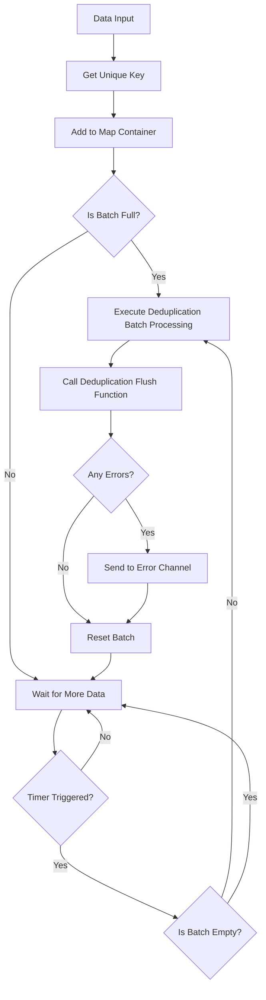

# Deduplication Pipeline

DeduplicationPipeline is another core component of Go Pipeline v2, providing deduplication batch processing functionality based on unique keys.

## Overview

Deduplication pipeline automatically removes duplicate data during batch processing, based on user-defined unique key functions to determine if data is duplicate. Suitable for data scenarios that require deduplication processing.

## Core Features

- **Automatic Deduplication**: Automatically removes duplicate data based on unique keys
- **Flexible Key Functions**: Supports custom unique key generation logic
- **Batch Processing Mechanism**: Supports automatic batch processing triggered by size and time intervals
- **Concurrent Safety**: Built-in goroutine safety mechanism
- **Error Handling**: Comprehensive error collection and propagation

## Data Flow



## Creating Deduplication Pipeline

### Using Default Configuration

```go
pipeline := gopipeline.NewDefaultDeduplicationPipeline(
    // Unique key function
    func(data User) string {
        return data.Email // Use email as unique key
    },
    // Batch processing function
    func(ctx context.Context, batchData []User) error {
        fmt.Printf("Processing %d deduplicated users\n", len(batchData))
        return nil
    },
)
```

### Using Custom Configuration

```go
deduplicationConfig := gopipeline.PipelineConfig{
    BufferSize:    200,                    // Buffer size
    FlushSize:     50,                     // Batch size
    FlushInterval: time.Millisecond * 100, // Flush interval
}

pipeline := gopipeline.NewDeduplicationPipeline(deduplicationConfig,
    // Unique key function
    func(data Product) string {
        return fmt.Sprintf("%s-%s", data.SKU, data.Version)
    },
    // Batch processing function
    func(ctx context.Context, batchData []Product) error {
        return processProducts(batchData)
    },
)
```

## Usage Examples

### User Data Deduplication Example

```go
package main

import (
    "context"
    "fmt"
    "log"
    "time"
    
    gopipeline "github.com/rushairer/go-pipeline/v2"
)

type User struct {
    ID    int
    Name  string
    Email string
}

func main() {
    // Create deduplication pipeline, deduplicate based on email
    pipeline := gopipeline.NewDefaultDeduplicationPipeline(
        func(user User) string {
            return user.Email // Email as unique key
        },
        func(ctx context.Context, users []User) error {
            fmt.Printf("Batch processing %d deduplicated users:\n", len(users))
            for _, user := range users {
                fmt.Printf("  - %s (%s)\n", user.Name, user.Email)
            }
            return nil
        },
    )
    
    ctx, cancel := context.WithTimeout(context.Background(), time.Second*5)
    defer cancel()
    
    // Start async processing
    go func() {
        if err := pipeline.AsyncPerform(ctx); err != nil {
            log.Printf("Pipeline execution error: %v", err)
        }
    }()
    
    // Listen for errors
    errorChan := pipeline.ErrorChan(10)
    go func() {
        for err := range errorChan {
            log.Printf("Processing error: %v", err)
        }
    }()
    
    // Add data (including duplicate emails)
    dataChan := pipeline.DataChan()
    users := []User{
        {ID: 1, Name: "Alice", Email: "alice@example.com"},
        {ID: 2, Name: "Bob", Email: "bob@example.com"},
        {ID: 3, Name: "Alice Updated", Email: "alice@example.com"}, // Duplicate email
        {ID: 4, Name: "Charlie", Email: "charlie@example.com"},
        {ID: 5, Name: "Bob Updated", Email: "bob@example.com"},     // Duplicate email
    }
    
    for _, user := range users {
        dataChan <- user
    }
    
    // Close data channel
    close(dataChan)
    
    // Wait for processing to complete
    time.Sleep(time.Second * 2)
}
```

### Product Data Deduplication Example

```go
type Product struct {
    SKU     string
    Name    string
    Version string
    Price   float64
}

func productDeduplicationExample() {
    // Deduplicate based on SKU+Version combination
    pipeline := gopipeline.NewDefaultDeduplicationPipeline(
        func(product Product) string {
            return fmt.Sprintf("%s-%s", product.SKU, product.Version)
        },
        func(ctx context.Context, products []Product) error {
            // Batch update product information
            return updateProducts(products)
        },
    )
    
    // Use pipeline...
}
```

### Log Deduplication Example

```go
type LogEntry struct {
    Timestamp time.Time
    Level     string
    Message   string
    Source    string
}

func logDeduplicationExample() {
    // Deduplicate based on message content and source
    pipeline := gopipeline.NewDefaultDeduplicationPipeline(
        func(log LogEntry) string {
            return fmt.Sprintf("%s-%s", log.Message, log.Source)
        },
        func(ctx context.Context, logs []LogEntry) error {
            // Batch write logs
            return writeLogsToStorage(logs)
        },
    )
    
    // Use pipeline...
}
```

## Unique Key Function Design

### Simple Field as Key

```go
// Use single field
func(user User) string {
    return user.Email
}
```

### Composite Fields as Key

```go
// Use multiple field combination
func(order Order) string {
    return fmt.Sprintf("%s-%s-%d", 
        order.CustomerID, 
        order.ProductID, 
        order.Timestamp.Unix())
}
```

### Complex Logic Key

```go
// Use complex logic to generate key
func(event Event) string {
    // Normalize processing
    normalized := strings.ToLower(strings.TrimSpace(event.Name))
    return fmt.Sprintf("%s-%s", normalized, event.Category)
}
```

### Hash Key

```go
import (
    "crypto/md5"
    "fmt"
)

func(data ComplexData) string {
    // Generate hash key for complex data
    content := fmt.Sprintf("%v", data)
    hash := md5.Sum([]byte(content))
    return fmt.Sprintf("%x", hash)
}
```

## Deduplication Strategy

### Keep Latest Data

Deduplication pipeline keeps the last added data by default:

```go
// If there are duplicate keys, later added data will overwrite earlier added data
dataChan <- User{ID: 1, Name: "Alice", Email: "alice@example.com"}
dataChan <- User{ID: 2, Name: "Alice Updated", Email: "alice@example.com"} // This will be kept
```

### Custom Deduplication Logic

If more complex deduplication logic is needed, it can be implemented in the batch processing function:

```go
func(ctx context.Context, users []User) error {
    // Custom deduplication logic: keep user with smallest ID
    userMap := make(map[string]User)
    for _, user := range users {
        if existing, exists := userMap[user.Email]; !exists || user.ID < existing.ID {
            userMap[user.Email] = user
        }
    }
    
    // Convert back to slice
    deduplicatedUsers := make([]User, 0, len(userMap))
    for _, user := range userMap {
        deduplicatedUsers = append(deduplicatedUsers, user)
    }
    
    return processUsers(deduplicatedUsers)
}
```

## Performance Considerations

### Memory Usage

Deduplication pipeline uses map to store data, memory usage is related to batch size:

```go
// Smaller batch size can reduce memory usage
memoryOptimizedConfig := gopipeline.PipelineConfig{
    BufferSize:    200,                   // Buffer size
    FlushSize:     100,                   // Store at most 100 unique items
    FlushInterval: time.Millisecond * 50, // Flush interval
}
```

### Key Function Performance

Ensure unique key function is efficient:

```go
// Good practice: simple field access
func(user User) string {
    return user.ID
}

// Avoid: complex calculations
func(user User) string {
    // Avoid complex calculations in key function
    return expensiveCalculation(user)
}
```

## Error Handling

```go
// Listen for errors
errorChan := pipeline.ErrorChan(10)
go func() {
    for err := range errorChan {
        log.Printf("Deduplication pipeline error: %v", err)
        
        // Can handle based on error type
        if isRetryableError(err) {
            // Retry logic
        }
    }
}()
```

## Best Practices

1. **Choose Appropriate Unique Key**: Ensure key can accurately identify data uniqueness
2. **Key Function Should Be Efficient**: Avoid complex calculations in key function
3. **Monitor Memory Usage**: Large batches may cause high memory usage
4. **Set Reasonable Batch Size**: Balance memory usage and processing efficiency
5. **Consume Error Channel Promptly**: Prevent error channel blocking

## Comparison with Standard Pipeline

| Feature | Standard Pipeline | Deduplication Pipeline |
|---------|-------------------|------------------------|
| Data Order | Maintains original order | No order guarantee |
| Memory Usage | Lower | Higher (needs to store map) |
| Processing Speed | Faster | Slower (needs deduplication calculation) |
| Use Cases | General batch processing | Scenarios requiring deduplication |

## Next Steps

- [Configuration Guide](./configuration) - Detailed configuration parameter instructions
- [API Reference](./api-reference) - Complete API documentation
- [Standard Pipeline](./standard-pipeline) - Standard pipeline usage guide