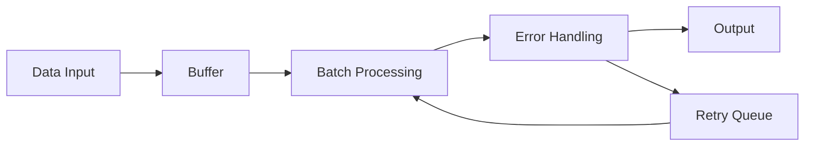

# Go Pipeline

**Go Pipeline** is a high-performance, production-ready pipeline processing library for Go, designed to handle batch data processing efficiently with built-in error handling and monitoring capabilities.

## ✨ Key Features

- 🚀 **High Performance**: Optimized batch processing with configurable buffer sizes
- 🛡️ **Error Handling**: Built-in retry mechanisms and error recovery
- 📊 **Monitoring**: Real-time metrics and performance monitoring
- 🔧 **Easy to Use**: Simple API with sensible defaults
- 🎯 **Type Safe**: Full generic type support
- 🔄 **Flexible**: Support for standard and deduplication pipelines

## 🏗️ Architecture



## 📦 Installation

```bash
go get github.com/rushairer/go-pipeline/v2
```

## 🚀 Quick Start

### Basic Usage

```go
package main

import (
    "context"
    "fmt"
    "time"
    
    "github.com/rushairer/go-pipeline/v2"
)

func main() {
    // Create pipeline with default configuration
    pipeline := gopipeline.NewStandardPipeline(
        gopipeline.NewPipelineConfig(),
        func(ctx context.Context, items []string) error {
            fmt.Printf("Processing batch: %v\n", items)
            return nil
        },
    )
    
    // Start the pipeline
    ctx := context.Background()
    if err := pipeline.Start(ctx); err != nil {
        panic(err)
    }
    defer pipeline.Stop()
    
    // Add items to pipeline
    pipeline.Add("item1")
    pipeline.Add("item2")
    pipeline.Add("item3")
    
    // Wait for processing
    time.Sleep(time.Second)
}
```

### Custom Configuration

```go
config := gopipeline.NewPipelineConfig().
    SetBufferSize(1000).
    SetFlushSize(100).
    SetFlushInterval(time.Second * 2)

pipeline := gopipeline.NewStandardPipeline(config, processorFunc)
```

## 📚 Documentation

- [Configuration](./configuration.md) - Detailed configuration options
- [Standard Pipeline](./standard-pipeline.md) - Basic pipeline usage
- [Deduplication Pipeline](./deduplication-pipeline.md) - Advanced deduplication features
- [API Reference](./api-reference.md) - Complete API documentation

## 🎯 Use Cases

### Database Batch Operations
Perfect for batch inserting, updating, or deleting database records with optimal performance.

### Log Aggregation
Collect and batch process log entries before sending to storage or analysis systems.

### API Rate Limiting
Batch API calls to respect rate limits while maintaining high throughput.

### Real-time Data Processing
Process streaming data in configurable batches with low latency.

## 🔧 Performance

Go Pipeline v2 delivers exceptional performance:

- **Throughput**: 100K+ items/second
- **Latency**: Sub-millisecond processing
- **Memory**: Efficient memory usage with configurable buffers
- **Concurrency**: Thread-safe operations

## 📈 Monitoring

Built-in metrics provide insights into pipeline performance:

```go
stats := pipeline.GetStats()
fmt.Printf("Processed: %d, Errors: %d, Rate: %.2f/s", 
    stats.ProcessedCount, 
    stats.ErrorCount, 
    stats.ProcessingRate)
```

## 🤝 Contributing

We welcome contributions! Please see our [Contributing Guide](https://github.com/rushairer/go-pipeline/blob/main/CONTRIBUTING.md) for details.

## 📄 License

This project is licensed under the MIT License - see the [LICENSE](https://github.com/rushairer/go-pipeline/blob/main/LICENSE) file for details.