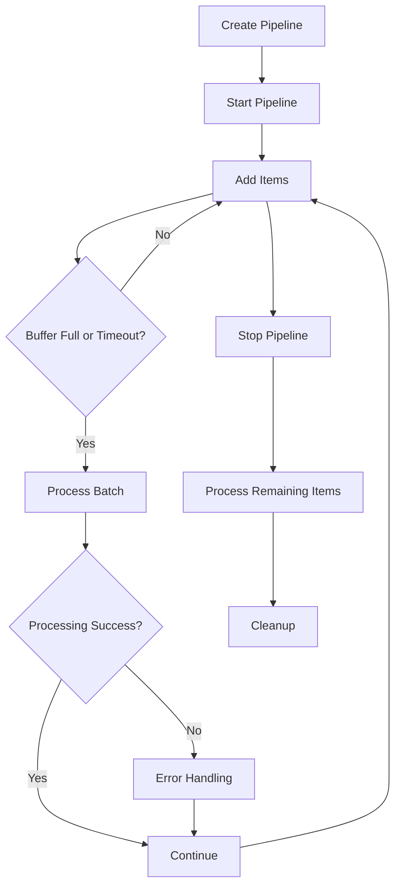

# Standard Pipeline

The Standard Pipeline is the core component of Go Pipeline v2, designed for efficient batch processing of data streams. It provides automatic batching, configurable processing intervals, and built-in error handling.

## Basic Usage

### Creating a Standard Pipeline

```go
package main

import (
    "context"
    "fmt"
    "time"
    
    "github.com/rushairer/go-pipeline/v2"
)

func main() {
    // Create pipeline with default configuration
    pipeline := gopipeline.NewStandardPipeline(
        gopipeline.NewPipelineConfig(),
        func(ctx context.Context, items []string) error {
            fmt.Printf("Processing batch: %v\n", items)
            return nil
        },
    )
    
    // Start the pipeline
    ctx := context.Background()
    if err := pipeline.Start(ctx); err != nil {
        panic(err)
    }
    defer pipeline.Stop()
    
    // Add items
    pipeline.Add("item1")
    pipeline.Add("item2")
    pipeline.Add("item3")
    
    // Wait for processing
    time.Sleep(time.Second)
}
```

### Using Custom Configuration

```go
customConfig := gopipeline.NewPipelineConfig().
    SetBufferSize(500).
    SetFlushSize(100).
    SetFlushInterval(time.Millisecond * 200)

pipeline := gopipeline.NewStandardPipeline(customConfig, processorFunc)
```

## Processing Function

The processor function is the core of your pipeline logic. It receives a batch of items and processes them:

```go
func processBatch(ctx context.Context, items []MyDataType) error {
    // Process the batch
    for _, item := range items {
        if err := processItem(item); err != nil {
            return fmt.Errorf("failed to process item %v: %w", item, err)
        }
    }
    return nil
}
```

### Error Handling in Processor

```go
func processBatchWithErrorHandling(ctx context.Context, items []MyDataType) error {
    var errors []error
    
    for _, item := range items {
        if err := processItem(item); err != nil {
            errors = append(errors, fmt.Errorf("item %v: %w", item.ID, err))
        }
    }
    
    if len(errors) > 0 {
        return fmt.Errorf("batch processing failed: %v", errors)
    }
    
    return nil
}
```

## Pipeline Lifecycle



## Advanced Usage

### 1. Batch Size Optimization

Adjust batch size based on processing capabilities:

```go
// For CPU-intensive operations
cpuIntensiveConfig := gopipeline.NewPipelineConfig().
    SetFlushSize(10).                     // Smaller batches
    SetFlushInterval(time.Millisecond * 50)

// For I/O operations
ioOptimizedConfig := gopipeline.NewPipelineConfig().
    SetFlushSize(100).                    // Larger batches
    SetFlushInterval(time.Millisecond * 200)
```

### 2. Context-aware Processing

Use context for cancellation and timeouts:

```go
func contextAwareProcessor(ctx context.Context, items []DataItem) error {
    // Check for cancellation
    select {
    case <-ctx.Done():
        return ctx.Err()
    default:
    }
    
    // Process with timeout
    processCtx, cancel := context.WithTimeout(ctx, time.Second*30)
    defer cancel()
    
    return processItemsWithContext(processCtx, items)
}
```

### 3. Metrics and Monitoring

Monitor pipeline performance:

```go
// Get pipeline statistics
stats := pipeline.GetStats()
fmt.Printf("Processed: %d items\n", stats.ProcessedCount)
fmt.Printf("Error rate: %.2f%%\n", stats.ErrorRate*100)
fmt.Printf("Average latency: %v\n", stats.AverageLatency)
fmt.Printf("Throughput: %.2f items/sec\n", stats.Throughput)
```

### 4. Graceful Shutdown

Implement proper shutdown handling:

```go
func runPipeline() {
    pipeline := gopipeline.NewStandardPipeline(config, processor)
    
    ctx, cancel := context.WithCancel(context.Background())
    defer cancel()
    
    // Start pipeline
    if err := pipeline.Start(ctx); err != nil {
        log.Fatal(err)
    }
    
    // Handle shutdown signals
    sigChan := make(chan os.Signal, 1)
    signal.Notify(sigChan, syscall.SIGINT, syscall.SIGTERM)
    
    go func() {
        <-sigChan
        log.Println("Shutting down pipeline...")
        cancel()
    }()
    
    // Add items...
    
    // Wait for context cancellation
    <-ctx.Done()
    
    // Graceful shutdown
    pipeline.Stop()
    log.Println("Pipeline stopped")
}
```

## Performance Optimization

### 1. Reasonable Batch Size Settings

```go
// Adjust batch size based on processing capacity
optimizedConfig := gopipeline.NewPipelineConfig()

// For fast processing
if processingTimePerItem < time.Millisecond {
    optimizedConfig.SetFlushSize(200) // Larger batches
}

// For slow processing
if processingTimePerItem > time.Millisecond*10 {
    optimizedConfig.SetFlushSize(20) // Smaller batches
}
```

### 2. Buffer Size Tuning

```go
// Adjust buffer size based on input rate
if inputRate > 1000 { // items per second
    config.SetBufferSize(1000) // Large buffer
} else {
    config.SetBufferSize(100)  // Standard buffer
}
```

### 3. Processing Interval Optimization

```go
// Balance between latency and throughput
if latencyRequirement < time.Millisecond*100 {
    config.SetFlushInterval(time.Millisecond * 50) // Low latency
} else {
    config.SetFlushInterval(time.Millisecond * 200) // Higher throughput
}
```

## Common Use Cases

### Database Batch Operations

```go
func batchInsertProcessor(ctx context.Context, records []Record) error {
    tx, err := db.BeginTx(ctx, nil)
    if err != nil {
        return err
    }
    defer tx.Rollback()
    
    stmt, err := tx.PrepareContext(ctx, "INSERT INTO table (col1, col2) VALUES (?, ?)")
    if err != nil {
        return err
    }
    defer stmt.Close()
    
    for _, record := range records {
        if _, err := stmt.ExecContext(ctx, record.Col1, record.Col2); err != nil {
            return err
        }
    }
    
    return tx.Commit()
}
```

### Log Aggregation

```go
func logAggregationProcessor(ctx context.Context, logs []LogEntry) error {
    // Group logs by level
    logsByLevel := make(map[string][]LogEntry)
    for _, log := range logs {
        logsByLevel[log.Level] = append(logsByLevel[log.Level], log)
    }
    
    // Write to different files based on level
    for level, levelLogs := range logsByLevel {
        if err := writeLogsToFile(level, levelLogs); err != nil {
            return err
        }
    }
    
    return nil
}
```

### API Rate Limiting

```go
func rateLimitedAPIProcessor(ctx context.Context, requests []APIRequest) error {
    // Respect API rate limits
    rateLimiter := time.NewTicker(time.Second / 10) // 10 requests per second
    defer rateLimiter.Stop()
    
    for _, request := range requests {
        select {
        case <-ctx.Done():
            return ctx.Err()
        case <-rateLimiter.C:
            if err := sendAPIRequest(request); err != nil {
                return err
            }
        }
    }
    
    return nil
}
```

## Error Handling Strategies

### 1. Fail Fast

```go
func failFastProcessor(ctx context.Context, items []DataItem) error {
    for _, item := range items {
        if err := processItem(item); err != nil {
            return err // Stop on first error
        }
    }
    return nil
}
```

### 2. Continue on Error

```go
func continueOnErrorProcessor(ctx context.Context, items []DataItem) error {
    var lastError error
    successCount := 0
    
    for _, item := range items {
        if err := processItem(item); err != nil {
            log.Printf("Failed to process item %v: %v", item.ID, err)
            lastError = err
        } else {
            successCount++
        }
    }
    
    // Return error only if all items failed
    if successCount == 0 && lastError != nil {
        return lastError
    }
    
    return nil
}
```

### 3. Partial Success Handling

```go
func partialSuccessProcessor(ctx context.Context, items []DataItem) error {
    results := make([]ProcessResult, len(items))
    
    for i, item := range items {
        if err := processItem(item); err != nil {
            results[i] = ProcessResult{Item: item, Error: err}
        } else {
            results[i] = ProcessResult{Item: item, Success: true}
        }
    }
    
    // Handle results
    return handleProcessResults(results)
}
```

## Best Practices

1. **Choose appropriate batch sizes**: Balance between throughput and latency
2. **Implement proper error handling**: Decide on fail-fast vs. continue-on-error strategy
3. **Monitor performance**: Use built-in metrics to optimize configuration
4. **Handle context cancellation**: Ensure graceful shutdown
5. **Test under load**: Validate performance under realistic conditions
6. **Use connection pooling**: For database operations, use connection pools
7. **Implement backpressure**: Handle cases where processing can't keep up with input