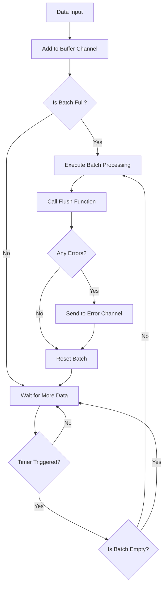

# Standard Pipeline

The Standard Pipeline (StandardPipeline) is one of the core components of Go Pipeline v2, providing sequential batch processing functionality.

## Overview

The standard pipeline batches input data according to configured batch size and time intervals, suitable for scenarios that require maintaining data order.

## Core Features

- **Sequential Processing**: Data is batch processed in the order it was added
- **Automatic Batching**: Supports automatic batch triggering by size and time interval
- **Concurrency Safety**: Built-in goroutine safety mechanisms
- **Error Handling**: Comprehensive error collection and propagation

## Data Flow


```mermaid
graph TD
    A["Data Input"] --> B["Add to Buffer Channel"]
    B --> C{"Is Batch Full?"}
    C -->|Yes| D["Execute Batch Processing"]
    C -->|No| E["Wait for More Data"]
    E --> F{"Timer Triggered?"}
    F -->|Yes| G{"Is Batch Empty?"}
    G -->|No| D
    G -->|Yes| E
    F -->|No| E
    D --> H["Call Flush Function"]
    H --> I{"Any Errors?"}
    I -->|Yes| J["Send to Error Channel"]
    I -->|No| K["Reset Batch"]
    J --> K
    K --> E
```

## Creating Standard Pipeline

### Using Default Configuration

```go
pipeline := gopipeline.NewDefaultStandardPipeline(
    func(ctx context.Context, batchData []string) error {
        // Process batch data
        fmt.Printf("Processing %d items: %v\n", len(batchData), batchData)
        return nil
    },
)
```

### Using Custom Configuration

```go
// Create configuration using chain methods
customConfig := gopipeline.NewPipelineConfig().
    WithBufferSize(200).
    WithFlushSize(100).
    WithFlushInterval(time.Millisecond * 100).
    WithDrainOnCancel(true).
    WithDrainGracePeriod(150 * time.Millisecond)

pipeline := gopipeline.NewStandardPipeline(customConfig,
    func(ctx context.Context, batchData []string) error {
        // Process batch data
        return processData(batchData)
    },
)
```

## Usage Examples

### Using Convenient API (Recommended)

```go
package main

import (
    "context"
    "fmt"
    "log"
    "time"
    
    gopipeline "github.com/rushairer/go-pipeline/v2"
)

func main() {
    // Create pipeline
    pipeline := gopipeline.NewDefaultStandardPipeline(
        func(ctx context.Context, batchData []string) error {
            fmt.Printf("Batch processing %d items: %v\n", len(batchData), batchData)
            // Simulate processing time
            time.Sleep(time.Millisecond * 10)
            return nil
        },
    )
    
    ctx, cancel := context.WithTimeout(context.Background(), time.Second*5)
    defer cancel()
    
    // Start using convenient API
    done, errs := pipeline.Start(ctx)
    
    // Listen for errors
    go func() {
        for err := range errs {
            log.Printf("Processing error: %v", err)
        }
    }()
    
    // Add data
    dataChan := pipeline.DataChan()
    go func() {
        defer close(dataChan) // Who writes, who closes
        for i := 0; i < 200; i++ {
            select {
            case dataChan <- fmt.Sprintf("data-%d", i):
            case <-ctx.Done():
                return
            }
        }
    }()
    
    // Wait for completion
    <-done
}
```

### Synchronous Execution Example

```go
func syncExample() {
    pipeline := gopipeline.NewDefaultStandardPipeline(
        func(ctx context.Context, batchData []string) error {
            fmt.Printf("Batch processing %d items: %v\n", len(batchData), batchData)
            return nil
        },
    )
    
    ctx, cancel := context.WithTimeout(context.Background(), time.Second*5)
    defer cancel()
    
    // Synchronous run, set error channel capacity to 128
    if err := pipeline.Run(ctx, 128); err != nil {
        log.Printf("Pipeline execution error: %v", err)
    }
}
```

### Database Batch Insert Example

```go
func batchInsertExample() {
    // Create database batch insert pipeline
    pipeline := gopipeline.NewDefaultStandardPipeline(
        func(ctx context.Context, users []User) error {
            // Batch insert to database
            return db.CreateInBatches(users, len(users)).Error
        },
    )
    
    ctx := context.Background()
    
    // Start pipeline
    go pipeline.AsyncPerform(ctx)
    
    // Error handling
    go func() {
        for err := range pipeline.ErrorChan(10) {
            log.Printf("Database insert error: %v", err)
        }
    }()
    
    // Add user data
    dataChan := pipeline.DataChan()
    for i := 0; i < 1000; i++ {
        user := User{
            Name:  fmt.Sprintf("user-%d", i),
            Email: fmt.Sprintf("user%d@example.com", i),
        }
        dataChan <- user
    }
    
    close(dataChan)
}
```

### API Call Batch Processing Example

```go
func apiCallExample() {
    pipeline := gopipeline.NewStandardPipeline(
        gopipeline.PipelineConfig{
            FlushSize:     20,                     // 20 items per call
            FlushInterval: time.Millisecond * 200, // 200ms interval
        },
        func(ctx context.Context, requests []APIRequest) error {
            // Batch call API
            return batchCallAPI(requests)
        },
    )
    
    // Use pipeline...
}
```

## Convenient API vs Traditional API

### Convenient API (Recommended)

New convenient API added in v2.2.2 to reduce boilerplate code:

```go
// Async start
done, errs := pipeline.Start(ctx)
go func() {
    for err := range errs {
        log.Printf("Error: %v", err)
    }
}()
<-done // Wait for completion

// Sync run
if err := pipeline.Run(ctx, 128); err != nil {
    log.Printf("Pipeline execution error: %v", err)
}
```

### Traditional API

```go
// Async execution
go func() {
    if err := pipeline.AsyncPerform(ctx); err != nil {
        log.Printf("Pipeline execution error: %v", err)
    }
}()

// Sync execution
if err := pipeline.SyncPerform(ctx); err != nil {
    log.Printf("Pipeline execution error: %v", err)
}
```

## Dynamic Parameter Adjustment

v2.2.2 supports runtime safe adjustment of key parameters:

```go
// Adjust parameters during runtime
pipeline.UpdateFlushSize(128)
pipeline.UpdateFlushInterval(25 * time.Millisecond)

// Example: Dynamic adjustment based on system load
go func() {
    ticker := time.NewTicker(time.Second * 30)
    defer ticker.Stop()
    
    for range ticker.C {
        load := getSystemLoad()
        if load > 0.8 {
            // Reduce batch size under high load
            pipeline.UpdateFlushSize(25)
            pipeline.UpdateFlushInterval(100 * time.Millisecond)
        } else {
            // Use standard configuration under normal load
            pipeline.UpdateFlushSize(50)
            pipeline.UpdateFlushInterval(50 * time.Millisecond)
        }
    }
}()
```

## Error Handling

Standard pipeline provides comprehensive error handling mechanisms:

```go
// Create error channel
errorChan := pipeline.ErrorChan(100) // Buffer size 100

// Listen for errors
go func() {
    for err := range errorChan {
        // Handle errors
        log.Printf("Batch processing error: %v", err)
        
        // Different handling based on error type
        switch e := err.(type) {
        case *DatabaseError:
            // Database error handling
        case *NetworkError:
            // Network error handling
        default:
            // Other error handling
        }
    }
}()
```

## Performance Optimization Recommendations

### 1. Set Appropriate Batch Size

```go
// Adjust batch size based on processing capacity
batchSizeConfig := gopipeline.PipelineConfig{
    BufferSize:    200,                   // Buffer size
    FlushSize:     100,                   // Larger batches can improve throughput
    FlushInterval: time.Millisecond * 50, // Standard interval
}
```

### 2. Adjust Buffer Size

```go
// Buffer should be at least 2x the batch size
bufferSizeConfig := gopipeline.PipelineConfig{
    BufferSize:    200,                   // FlushSize * 2
    FlushSize:     100,                   // Batch size
    FlushInterval: time.Millisecond * 50, // Standard interval
}
```

### 3. Optimize Flush Interval

```go
// Adjust interval based on latency requirements
// Low latency configuration
lowLatencyConfig := gopipeline.PipelineConfig{
    BufferSize:    100,                   // Moderate buffer
    FlushSize:     50,                    // Moderate batch
    FlushInterval: time.Millisecond * 50, // Low latency
}

// High throughput configuration
highThroughputConfig := gopipeline.PipelineConfig{
    BufferSize:    400,       // Large buffer
    FlushSize:     200,       // Large batch
    FlushInterval: time.Second, // High throughput
}
```

## Best Practices

1. **Consume Error Channel Promptly**: Must have goroutine consuming error channel, otherwise may cause blocking
2. **Close Channels Properly**: Use "who writes, who closes" principle to manage channel lifecycle
3. **Set Reasonable Timeouts**: Use context to control pipeline execution time
4. **Monitor Performance**: Adjust configuration parameters based on actual scenarios

## Next Steps

- [Deduplication Pipeline](./deduplication-pipeline) - Learn about deduplication batch processing pipelines
- [Configuration Guide](./configuration) - Detailed configuration parameter descriptions
- [API Reference](./api-reference) - Complete API documentation