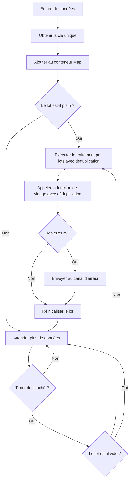

# Pipeline de déduplication

DeduplicationPipeline est un autre composant principal de Go Pipeline v2, fournissant une fonctionnalité de traitement par lots avec déduplication basée sur des clés uniques.

## Vue d'ensemble

Le pipeline de déduplication supprime automatiquement les données dupliquées pendant le traitement par lots, basé sur des fonctions de clé unique définies par l'utilisateur pour déterminer si les données sont dupliquées. Adapté aux scénarios de données qui nécessitent un traitement de déduplication.

## Fonctionnalités principales

- **Déduplication automatique** : Supprime automatiquement les données dupliquées basées sur des clés uniques
- **Fonctions de clé flexibles** : Prend en charge la logique personnalisée de génération de clés uniques
- **Mécanisme de traitement par lots** : Prend en charge le traitement automatique par lots déclenché par la taille et les intervalles de temps
- **Sécurité concurrentielle** : Mécanisme de sécurité goroutine intégré
- **Gestion d'erreurs** : Collecte et propagation d'erreurs complètes

## Flux de données



## Création d'un pipeline de déduplication

### Utilisation de la configuration par défaut

```go
pipeline := gopipeline.NewDefaultDeduplicationPipeline(
    // Fonction de clé unique
    func(data User) string {
        return data.Email // Utiliser l'email comme clé unique
    },
    // Fonction de traitement par lots
    func(ctx context.Context, batchData []User) error {
        fmt.Printf("Traitement de %d utilisateurs dédupliqués\n", len(batchData))
        return nil
    },
)
```

### Utilisation d'une configuration personnalisée

```go
deduplicationConfig := gopipeline.PipelineConfig{
    BufferSize:    200,                    // Taille du tampon
    FlushSize:     50,                     // Taille du lot
    FlushInterval: time.Millisecond * 100, // Intervalle de vidage
}

pipeline := gopipeline.NewDeduplicationPipeline(deduplicationConfig,
    // Fonction de clé unique
    func(data Product) string {
        return fmt.Sprintf("%s-%s", data.SKU, data.Version)
    },
    // Fonction de traitement par lots
    func(ctx context.Context, batchData []Product) error {
        return processProducts(batchData)
    },
)
```

## Exemples d'utilisation

### Exemple de déduplication de données utilisateur

```go
package main

import (
    "context"
    "fmt"
    "log"
    "time"
    
    gopipeline "github.com/rushairer/go-pipeline/v2"
)

type User struct {
    ID    int
    Name  string
    Email string
}

func main() {
    // Créer un pipeline de déduplication, dédupliquer basé sur l'email
    pipeline := gopipeline.NewDefaultDeduplicationPipeline(
        func(user User) string {
            return user.Email // Email comme clé unique
        },
        func(ctx context.Context, users []User) error {
            fmt.Printf("Traitement par lots de %d utilisateurs dédupliqués :\n", len(users))
            for _, user := range users {
                fmt.Printf("  - %s (%s)\n", user.Name, user.Email)
            }
            return nil
        },
    )
    
    ctx, cancel := context.WithTimeout(context.Background(), time.Second*5)
    defer cancel()
    
    // Démarrer le traitement asynchrone
    go func() {
        if err := pipeline.AsyncPerform(ctx); err != nil {
            log.Printf("Erreur d'exécution du pipeline : %v", err)
        }
    }()
    
    // Écouter les erreurs
    errorChan := pipeline.ErrorChan(10)
    go func() {
        for err := range errorChan {
            log.Printf("Erreur de traitement : %v", err)
        }
    }()
    
    // Ajouter des données (incluant des emails dupliqués)
    dataChan := pipeline.DataChan()
    users := []User{
        {ID: 1, Name: "Alice", Email: "alice@example.com"},
        {ID: 2, Name: "Bob", Email: "bob@example.com"},
        {ID: 3, Name: "Alice Updated", Email: "alice@example.com"}, // Email dupliqué
        {ID: 4, Name: "Charlie", Email: "charlie@example.com"},
        {ID: 5, Name: "Bob Updated", Email: "bob@example.com"},     // Email dupliqué
    }
    
    for _, user := range users {
        dataChan <- user
    }
    
    // Fermer le canal de données
    close(dataChan)
    
    // Attendre la fin du traitement
    time.Sleep(time.Second * 2)
}
```

### Exemple de déduplication de données produit

```go
type Product struct {
    SKU     string
    Name    string
    Version string
    Price   float64
}

func productDeduplicationExample() {
    // Dédupliquer basé sur la combinaison SKU+Version
    pipeline := gopipeline.NewDefaultDeduplicationPipeline(
        func(product Product) string {
            return fmt.Sprintf("%s-%s", product.SKU, product.Version)
        },
        func(ctx context.Context, products []Product) error {
            // Mise à jour par lots des informations produit
            return updateProducts(products)
        },
    )
    
    // Utiliser le pipeline...
}
```

### Exemple de déduplication de logs

```go
type LogEntry struct {
    Timestamp time.Time
    Level     string
    Message   string
    Source    string
}

func logDeduplicationExample() {
    // Dédupliquer basé sur le contenu du message et la source
    pipeline := gopipeline.NewDefaultDeduplicationPipeline(
        func(log LogEntry) string {
            return fmt.Sprintf("%s-%s", log.Message, log.Source)
        },
        func(ctx context.Context, logs []LogEntry) error {
            // Écriture par lots des logs
            return writeLogsToStorage(logs)
        },
    )
    
    // Utiliser le pipeline...
}
```

## Conception de fonction de clé unique

### Champ simple comme clé

```go
// Utiliser un seul champ
func(user User) string {
    return user.Email
}
```

### Champs composites comme clé

```go
// Utiliser une combinaison de plusieurs champs
func(order Order) string {
    return fmt.Sprintf("%s-%s-%d", 
        order.CustomerID, 
        order.ProductID, 
        order.Timestamp.Unix())
}
```

### Clé de logique complexe

```go
// Utiliser une logique complexe pour générer la clé
func(event Event) string {
    // Traitement de normalisation
    normalized := strings.ToLower(strings.TrimSpace(event.Name))
    return fmt.Sprintf("%s-%s", normalized, event.Category)
}
```

### Clé de hachage

```go
import (
    "crypto/md5"
    "fmt"
)

func(data ComplexData) string {
    // Générer une clé de hachage pour des données complexes
    content := fmt.Sprintf("%v", data)
    hash := md5.Sum([]byte(content))
    return fmt.Sprintf("%x", hash)
}
```

## Stratégie de déduplication

### Conserver les dernières données

Le pipeline de déduplication conserve les dernières données ajoutées par défaut :

```go
// S'il y a des clés dupliquées, les données ajoutées plus tard écraseront les données ajoutées plus tôt
dataChan <- User{ID: 1, Name: "Alice", Email: "alice@example.com"}
dataChan <- User{ID: 2, Name: "Alice Updated", Email: "alice@example.com"} // Ceci sera conservé
```

### Logique de déduplication personnalisée

Si une logique de déduplication plus complexe est nécessaire, elle peut être implémentée dans la fonction de traitement par lots :

```go
func(ctx context.Context, users []User) error {
    // Logique de déduplication personnalisée : conserver l'utilisateur avec le plus petit ID
    userMap := make(map[string]User)
    for _, user := range users {
        if existing, exists := userMap[user.Email]; !exists || user.ID < existing.ID {
            userMap[user.Email] = user
        }
    }
    
    // Reconvertir en slice
    deduplicatedUsers := make([]User, 0, len(userMap))
    for _, user := range userMap {
        deduplicatedUsers = append(deduplicatedUsers, user)
    }
    
    return processUsers(deduplicatedUsers)
}
```

## Considérations de performance

### Utilisation mémoire

Le pipeline de déduplication utilise une map pour stocker les données, l'utilisation mémoire est liée à la taille du lot :

```go
// Une taille de lot plus petite peut réduire l'utilisation mémoire
configOptimiseMemoire := gopipeline.PipelineConfig{
    BufferSize:    200,                   // Taille du tampon
    FlushSize:     100,                   // Stocker au maximum 100 éléments uniques
    FlushInterval: time.Millisecond * 50, // Intervalle de vidage
}
```

### Performance de la fonction de clé

S'assurer que la fonction de clé unique est efficace :

```go
// Bonne pratique : accès simple aux champs
func(user User) string {
    return user.ID
}

// Éviter : calculs complexes
func(user User) string {
    // Éviter les calculs complexes dans la fonction de clé
    return expensiveCalculation(user)
}
```

## Gestion d'erreurs

```go
// Écouter les erreurs
errorChan := pipeline.ErrorChan(10)
go func() {
    for err := range errorChan {
        log.Printf("Erreur du pipeline de déduplication : %v", err)
        
        // Peut gérer basé sur le type d'erreur
        if isRetryableError(err) {
            // Logique de retry
        }
    }
}()
```

## Meilleures pratiques

1. **Choisir une clé unique appropriée** : S'assurer que la clé peut identifier avec précision l'unicité des données
2. **La fonction de clé devrait être efficace** : Éviter les calculs complexes dans la fonction de clé
3. **Surveiller l'utilisation mémoire** : De gros lots peuvent causer une utilisation mémoire élevée
4. **Définir une taille de lot raisonnable** : Équilibrer l'utilisation mémoire et l'efficacité de traitement
5. **Consommer rapidement le canal d'erreur** : Prévenir le blocage du canal d'erreur

## Comparaison avec le pipeline standard

| Fonctionnalité | Pipeline standard | Pipeline de déduplication |
|----------------|-------------------|---------------------------|
| Ordre des données | Maintient l'ordre original | Aucune garantie d'ordre |
| Utilisation mémoire | Plus faible | Plus élevée (besoin de stocker la map) |
| Vitesse de traitement | Plus rapide | Plus lente (besoin de calcul de déduplication) |
| Cas d'usage | Traitement par lots général | Scénarios nécessitant une déduplication |

## Étapes suivantes

- [Guide de configuration](./configuration) - Instructions détaillées des paramètres de configuration
- [Référence API](./api-reference) - Documentation API complète
- [Pipeline standard](./standard-pipeline) - Guide d'utilisation du pipeline standard