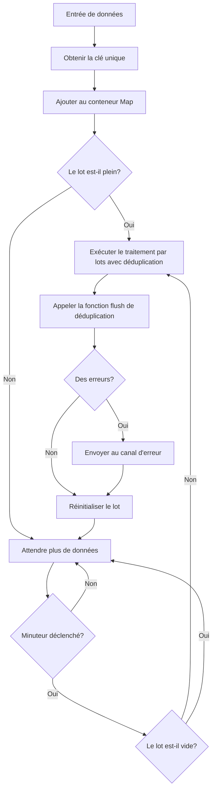

# Pipeline de Déduplication

Le Pipeline de Déduplication (DeduplicationPipeline) est un autre composant principal de Go Pipeline v2, fournissant une fonctionnalité de traitement par lots avec déduplication basée sur des clés uniques.

## Aperçu

Le pipeline de déduplication supprime automatiquement les données dupliquées pendant le traitement par lots, basé sur la méthode `GetKey()` de l'interface `UniqueKeyData` implémentée par le type de données pour déterminer si les données sont dupliquées. Il est adapté aux scénarios de données qui nécessitent un traitement de déduplication.

## Fonctionnalités principales

- **Déduplication automatique** : Supprime automatiquement les données dupliquées basées sur des clés uniques
- **Contraintes d'interface** : Assure la génération de clés uniques type-safe grâce à l'interface `UniqueKeyData`
- **Traitement par lots** : Prend en charge le déclenchement automatique de lots par taille et intervalle de temps
- **Sécurité de concurrence** : Mécanismes de sécurité goroutine intégrés
- **Gestion des erreurs** : Collection et propagation complètes des erreurs

## Flux de données


```mermaid
graph TD
    A["Entrée de données"] --> B["Obtenir la clé unique"]
    B --> C["Ajouter au conteneur Map"]
    C --> D{"Le lot est-il plein?"}
    D -->|Oui| E["Exécuter le traitement par lots avec déduplication"]
    D -->|Non| F["Attendre plus de données"]
    F --> G{"Minuteur déclenché?"}
    G -->|Oui| H{"Le lot est-il vide?"}
    H -->|Non| E
    H -->|Oui| F
    G -->|Non| F
    E --> I["Appeler la fonction flush de déduplication"]
    I --> J{"Des erreurs?"}
    J -->|Oui| K["Envoyer au canal d'erreur"]
    J -->|Non| L["Réinitialiser le lot"]
    K --> L
    L --> F
```

## Création du Pipeline de Déduplication

### Utilisation de la configuration par défaut

```go
// Définir une structure de données implémentant l'interface UniqueKeyData
type User struct {
    ID    int
    Name  string
    Email string
}

func (u User) GetKey() string {
    return u.Email
}

pipeline := gopipeline.NewDefaultDeduplicationPipeline(
    func(ctx context.Context, batchData map[string]User) error {
        fmt.Printf("Traitement de %d utilisateurs dédupliqués\n", len(batchData))
        for key, user := range batchData {
            fmt.Printf("  %s: %s\n", key, user.Name)
        }
        return nil
    },
)
```

### Utilisation d'une configuration personnalisée

```go
type Product struct {
    SKU     string
    Name    string
    Version string
    Price   float64
}

func (p Product) GetKey() string {
    return fmt.Sprintf("%s-%s", p.SKU, p.Version)
}

deduplicationConfig := gopipeline.NewPipelineConfig().
    WithBufferSize(200).
    WithFlushSize(50).
    WithFlushInterval(time.Millisecond * 100).
    WithDrainOnCancel(true)

pipeline := gopipeline.NewDeduplicationPipeline(deduplicationConfig,
    func(ctx context.Context, batchData map[string]Product) error {
        return processProducts(batchData)
    },
)
```

## Exemples d'utilisation

### Exemple de déduplication de données utilisateur

```go
package main

import (
    "context"
    "fmt"
    "log"
    "time"
    
    gopipeline "github.com/rushairer/go-pipeline/v2"
)

type User struct {
    ID    int
    Name  string
    Email string
}

func (u User) GetKey() string {
    return u.Email
}

func main() {
    // Créer un pipeline de déduplication
    pipeline := gopipeline.NewDefaultDeduplicationPipeline(
        func(ctx context.Context, users map[string]User) error {
            fmt.Printf("Traitement par lots de %d utilisateurs dédupliqués :\n", len(users))
            for key, user := range users {
                fmt.Printf("  - %s: %s (%s)\n", key, user.Name, user.Email)
            }
            return nil
        },
    )
    
    ctx, cancel := context.WithTimeout(context.Background(), time.Second*5)
    defer cancel()
    
    // Démarrer avec l'API pratique
    done, errs := pipeline.Start(ctx)
    
    // Écouter les erreurs
    go func() {
        for err := range errs {
            log.Printf("Erreur de traitement : %v", err)
        }
    }()
    
    // Ajouter des données (incluant des emails dupliqués)
    dataChan := pipeline.DataChan()
    go func() {
        defer close(dataChan) // Qui écrit, qui ferme
        
        users := []User{
            {ID: 1, Name: "Alice", Email: "alice@example.com"},
            {ID: 2, Name: "Bob", Email: "bob@example.com"},
            {ID: 3, Name: "Alice Updated", Email: "alice@example.com"}, // Email dupliqué, écrasera le premier
            {ID: 4, Name: "Charlie", Email: "charlie@example.com"},
            {ID: 5, Name: "Bob Updated", Email: "bob@example.com"},     // Email dupliqué, écrasera le premier
        }
        
        for _, user := range users {
            select {
            case dataChan <- user:
            case <-ctx.Done():
                return
            }
        }
    }()
    
    // Attendre la fin
    <-done
}
```

### Exemple de déduplication de données produit

```go
type Product struct {
    SKU     string
    Name    string
    Version string
    Price   float64
}

func (p Product) GetKey() string {
    return fmt.Sprintf("%s-%s", p.SKU, p.Version)
}

func productDeduplicationExample() {
    // Déduplication basée sur la combinaison SKU+Version
    pipeline := gopipeline.NewDefaultDeduplicationPipeline(
        func(ctx context.Context, products map[string]Product) error {
            // Mise à jour par lots des informations produit
            return updateProducts(products)
        },
    )
    
    // Utiliser le pipeline...
}
```

### Exemple de déduplication de logs

```go
type LogEntry struct {
    Timestamp time.Time
    Level     string
    Message   string
    Source    string
}

func (l LogEntry) GetKey() string {
    return fmt.Sprintf("%s-%s", l.Message, l.Source)
}

func logDeduplicationExample() {
    // Déduplication basée sur le contenu du message et la source
    pipeline := gopipeline.NewDefaultDeduplicationPipeline(
        func(ctx context.Context, logs map[string]LogEntry) error {
            // Écriture par lots des logs
            return writeLogsToStorage(logs)
        },
    )
    
    // Utiliser le pipeline...
}
```

## Conception de fonction de clé unique

### Champ simple comme clé

```go
// Utiliser un seul champ
func (user User) GetKey() string {
    return user.Email
}
```

### Champs combinés comme clé

```go
// Utiliser une combinaison de plusieurs champs
func (order Order) GetKey() string {
    return fmt.Sprintf("%s-%s-%d", 
        order.CustomerID, 
        order.ProductID, 
        order.Timestamp.Unix())
}
```

### Clé avec logique complexe

```go
// Utiliser une logique complexe pour générer la clé
func (event Event) GetKey() string {
    // Traitement de normalisation
    normalized := strings.ToLower(strings.TrimSpace(event.Name))
    return fmt.Sprintf("%s-%s", normalized, event.Category)
}
```

### Clé de hachage

```go
import (
    "crypto/md5"
    "fmt"
)

func (data ComplexData) GetKey() string {
    // Générer une clé de hachage pour des données complexes
    content := fmt.Sprintf("%v", data)
    hash := md5.Sum([]byte(content))
    return fmt.Sprintf("%x", hash)
}
```

## Stratégie de déduplication

### Conserver les dernières données

Le pipeline de déduplication conserve les dernières données ajoutées par défaut :

```go
// S'il y a des clés dupliquées, les données ajoutées plus tard écraseront celles ajoutées plus tôt
dataChan <- User{ID: 1, Name: "Alice", Email: "alice@example.com"}
dataChan <- User{ID: 2, Name: "Alice Updated", Email: "alice@example.com"} // Celui-ci sera conservé
```

### Logique de déduplication personnalisée

Si une logique de déduplication plus complexe est nécessaire, elle peut être implémentée dans la fonction de traitement par lots :

```go
func(ctx context.Context, users map[string]User) error {
    // Logique de déduplication personnalisée : conserver l'utilisateur avec l'ID le plus petit
    userMap := make(map[string]User)
    for _, user := range users {
        if existing, exists := userMap[user.Email]; !exists || user.ID < existing.ID {
            userMap[user.Email] = user
        }
    }
    
    // Reconvertir en slice
    deduplicatedUsers := make([]User, 0, len(userMap))
    for _, user := range userMap {
        deduplicatedUsers = append(deduplicatedUsers, user)
    }
    
    return processUsers(deduplicatedUsers)
}
```

## Considérations de performance

### Utilisation de la mémoire

Le pipeline de déduplication utilise une map pour stocker les données, l'utilisation de la mémoire est liée à la taille du lot :

```go
// Une taille de lot plus petite peut réduire l'utilisation de la mémoire
memoryOptimizedConfig := gopipeline.PipelineConfig{
    BufferSize:    200,                   // Taille du tampon
    FlushSize:     100,                   // Stocker au maximum 100 éléments uniques
    FlushInterval: time.Millisecond * 50, // Intervalle de flush
}
```

### Performance de la fonction de clé

Assurez-vous que la fonction de clé unique est efficace :

```go
// Bonne pratique : accès simple aux champs
func (user User) GetKey() string {
    return user.ID
}

// À éviter : calculs complexes
func (user User) GetKey() string {
    // Éviter les calculs complexes dans la fonction de clé
    return expensiveCalculation(user)
}
```

## Gestion des erreurs

```go
// Écouter les erreurs
errorChan := pipeline.ErrorChan(10)
go func() {
    for err := range errorChan {
        log.Printf("Erreur du pipeline de déduplication : %v", err)
        
        // Gérer selon le type d'erreur
        if isRetryableError(err) {
            // Logique de retry
        }
    }
}()
```

## Meilleures pratiques

1. **Choisir une clé unique appropriée** : Assurer que la clé peut identifier avec précision l'unicité des données
2. **La fonction de clé doit être efficace** : Éviter les calculs complexes dans les fonctions de clé
3. **Surveiller l'utilisation de la mémoire** : Les gros lots peuvent entraîner une utilisation élevée de la mémoire
4. **Définir une taille de lot raisonnable** : Équilibrer l'utilisation de la mémoire et l'efficacité de traitement
5. **Consommer le canal d'erreur rapidement** : Prévenir le blocage du canal d'erreur

## Comparaison avec le Pipeline Standard

| Fonctionnalité | Pipeline Standard | Pipeline de Déduplication |
|----------------|-------------------|---------------------------|
| Ordre des données | Maintient l'ordre original | Pas de garantie d'ordre |
| Utilisation mémoire | Plus faible | Plus élevée (besoin de stocker la map) |
| Vitesse de traitement | Plus rapide | Plus lente (besoin de calcul de déduplication) |
| Cas d'usage | Traitement par lots général | Scénarios nécessitant une déduplication |

## Étapes suivantes

- [Guide de Configuration](./configuration) - Descriptions détaillées des paramètres de configuration
- [Référence API](./api-reference) - Documentation API complète
- [Pipeline Standard](./standard-pipeline) - Guide d'utilisation du pipeline standard