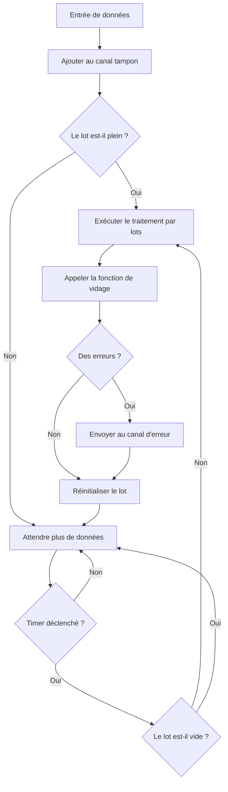

# Pipeline standard

StandardPipeline est l'un des composants principaux de Go Pipeline v2, fournissant une fonctionnalité de traitement par lots séquentiel pour les données.

## Vue d'ensemble

Le pipeline standard traite les données d'entrée par lots selon la taille de lot configurée et les intervalles de temps, adapté aux scénarios qui nécessitent de maintenir l'ordre des données.

## Fonctionnalités principales

- **Traitement séquentiel** : Les données sont traitées par lots dans l'ordre où elles ont été ajoutées
- **Traitement automatique par lots** : Prend en charge le traitement automatique par lots déclenché par la taille et les intervalles de temps
- **Sécurité concurrentielle** : Mécanisme de sécurité goroutine intégré
- **Gestion d'erreurs** : Collecte et propagation d'erreurs complètes

## Flux de données



## Création d'un pipeline standard

### Utilisation de la configuration par défaut

```go
pipeline := gopipeline.NewDefaultStandardPipeline(
    func(ctx context.Context, batchData []string) error {
        // Traiter les données par lots
        fmt.Printf("Traitement de %d éléments : %v\n", len(batchData), batchData)
        return nil
    },
)
```

### Utilisation d'une configuration personnalisée

```go
customConfig := gopipeline.PipelineConfig{
    BufferSize:    200,                    // Taille du tampon
    FlushSize:     100,                    // Taille du lot
    FlushInterval: time.Millisecond * 100, // Intervalle de vidage
}

pipeline := gopipeline.NewStandardPipeline(customConfig,
    func(ctx context.Context, batchData []string) error {
        // Traiter les données par lots
        return processData(batchData)
    },
)
```

## Exemples d'utilisation

### Utilisation de base

```go
package main

import (
    "context"
    "fmt"
    "log"
    "time"
    
    gopipeline "github.com/rushairer/go-pipeline/v2"
)

func main() {
    // Créer le pipeline
    pipeline := gopipeline.NewDefaultStandardPipeline(
        func(ctx context.Context, batchData []string) error {
            fmt.Printf("Traitement par lots de %d éléments : %v\n", len(batchData), batchData)
            // Simuler le temps de traitement
            time.Sleep(time.Millisecond * 10)
            return nil
        },
    )
    
    ctx, cancel := context.WithTimeout(context.Background(), time.Second*5)
    defer cancel()
    
    // Démarrer le traitement asynchrone
    go func() {
        if err := pipeline.AsyncPerform(ctx); err != nil {
            log.Printf("Erreur d'exécution du pipeline : %v", err)
        }
    }()
    
    // Écouter les erreurs
    errorChan := pipeline.ErrorChan(10)
    go func() {
        for err := range errorChan {
            log.Printf("Erreur de traitement : %v", err)
        }
    }()
    
    // Ajouter des données
    dataChan := pipeline.DataChan()
    for i := 0; i < 200; i++ {
        dataChan <- fmt.Sprintf("data-%d", i)
    }
    
    // Fermer le canal de données
    close(dataChan)
    
    // Attendre la fin du traitement
    time.Sleep(time.Second * 2)
}
```

### Exemple d'insertion par lots en base de données

```go
func batchInsertExample() {
    // Créer un pipeline d'insertion par lots en base de données
    pipeline := gopipeline.NewDefaultStandardPipeline(
        func(ctx context.Context, users []User) error {
            // Insertion par lots en base de données
            return db.CreateInBatches(users, len(users)).Error
        },
    )
    
    ctx := context.Background()
    
    // Démarrer le pipeline
    go pipeline.AsyncPerform(ctx)
    
    // Gestion d'erreurs
    go func() {
        for err := range pipeline.ErrorChan(10) {
            log.Printf("Erreur d'insertion en base de données : %v", err)
        }
    }()
    
    // Ajouter des données utilisateur
    dataChan := pipeline.DataChan()
    for i := 0; i < 1000; i++ {
        user := User{
            Name:  fmt.Sprintf("user-%d", i),
            Email: fmt.Sprintf("user%d@example.com", i),
        }
        dataChan <- user
    }
    
    close(dataChan)
}
```

### Exemple de traitement par lots d'appels API

```go
func apiCallExample() {
    pipeline := gopipeline.NewStandardPipeline(
        gopipeline.PipelineConfig{
            FlushSize:     20,                     // 20 éléments par appel
            FlushInterval: time.Millisecond * 200, // Intervalle de 200ms
        },
        func(ctx context.Context, requests []APIRequest) error {
            // Appel API par lots
            return batchCallAPI(requests)
        },
    )
    
    // Utiliser le pipeline...
}
```

## Exécution synchrone vs asynchrone

### Exécution asynchrone (recommandée)

```go
// Exécution asynchrone, ne bloque pas le thread principal
go func() {
    if err := pipeline.AsyncPerform(ctx); err != nil {
        log.Printf("Erreur d'exécution du pipeline : %v", err)
    }
}()
```

### Exécution synchrone

```go
// Exécution synchrone, bloque jusqu'à la fin ou l'annulation
if err := pipeline.SyncPerform(ctx); err != nil {
    log.Printf("Erreur d'exécution du pipeline : %v", err)
}
```

## Gestion d'erreurs

Le pipeline standard fournit un mécanisme complet de gestion d'erreurs :

```go
// Créer un canal d'erreur
errorChan := pipeline.ErrorChan(100) // Taille de tampon 100

// Écouter les erreurs
go func() {
    for err := range errorChan {
        // Gérer les erreurs
        log.Printf("Erreur de traitement par lots : %v", err)
        
        // Peut gérer différents types d'erreurs différemment
        switch e := err.(type) {
        case *DatabaseError:
            // Gestion d'erreur de base de données
        case *NetworkError:
            // Gestion d'erreur réseau
        default:
            // Gestion d'autres erreurs
        }
    }
}()
```

## Recommandations d'optimisation des performances

### 1. Définir une taille de lot raisonnable

```go
// Ajuster la taille du lot selon la capacité de traitement
batchSizeConfig := gopipeline.PipelineConfig{
    BufferSize:    200,                   // Taille du tampon
    FlushSize:     100,                   // Des lots plus grands peuvent améliorer le débit
    FlushInterval: time.Millisecond * 50, // Intervalle standard
}
```

### 2. Ajuster la taille du tampon

```go
// Le tampon devrait être au moins 2x la taille du lot
bufferSizeConfig := gopipeline.PipelineConfig{
    BufferSize:    200,                   // FlushSize * 2
    FlushSize:     100,                   // Taille du lot
    FlushInterval: time.Millisecond * 50, // Intervalle standard
}
```

### 3. Optimiser l'intervalle de vidage

```go
// Ajuster l'intervalle selon les exigences de latence
// Configuration de faible latence
configFaibleLatence := gopipeline.PipelineConfig{
    BufferSize:    100,                   // Tampon modéré
    FlushSize:     50,                    // Lot modéré
    FlushInterval: time.Millisecond * 50, // Faible latence
}

// Configuration de haut débit
configHautDebit := gopipeline.PipelineConfig{
    BufferSize:    400,       // Grand tampon
    FlushSize:     200,       // Grand lot
    FlushInterval: time.Second, // Haut débit
}
```

## Meilleures pratiques

1. **Consommer rapidement le canal d'erreur** : Doit avoir une goroutine consommant le canal d'erreur, sinon peut causer un blocage
2. **Fermer correctement les canaux** : Utiliser le principe "l'écrivain ferme" pour gérer le cycle de vie des canaux
3. **Définir des timeouts raisonnables** : Utiliser le contexte pour contrôler le temps d'exécution du pipeline
4. **Surveiller les performances** : Ajuster les paramètres de configuration selon les scénarios réels

## Étapes suivantes

- [Pipeline de déduplication](./deduplication-pipeline) - Apprendre le pipeline de traitement par lots avec déduplication
- [Guide de configuration](./configuration) - Instructions détaillées des paramètres de configuration
- [Référence API](./api-reference) - Documentation API complète