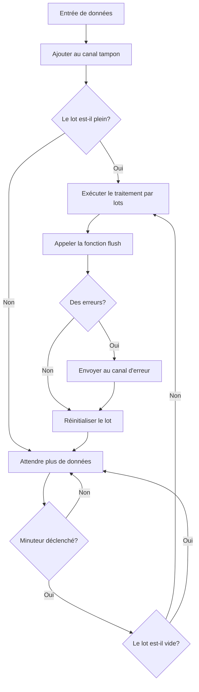

# Pipeline Standard

Le Pipeline Standard (StandardPipeline) est l'un des composants principaux de Go Pipeline v2, fournissant une fonctionnalité de traitement par lots séquentiel.

## Aperçu

Le pipeline standard traite les données d'entrée par lots selon la taille de lot configurée et les intervalles de temps, adapté aux scénarios qui nécessitent de maintenir l'ordre des données.

## Fonctionnalités principales

- **Traitement séquentiel** : Les données sont traitées par lots dans l'ordre où elles ont été ajoutées
- **Traitement automatique par lots** : Prend en charge le déclenchement automatique de lots par taille et intervalle de temps
- **Sécurité de concurrence** : Mécanismes de sécurité goroutine intégrés
- **Gestion des erreurs** : Collection et propagation complètes des erreurs

## Flux de données


```mermaid
graph TD
    A["Entrée de données"] --> B["Ajouter au canal tampon"]
    B --> C{"Le lot est-il plein?"}
    C -->|Oui| D["Exécuter le traitement par lots"]
    C -->|Non| E["Attendre plus de données"]
    E --> F{"Minuteur déclenché?"}
    F -->|Oui| G{"Le lot est-il vide?"}
    G -->|Non| D
    G -->|Oui| E
    F -->|Non| E
    D --> H["Appeler la fonction flush"]
    H --> I{"Des erreurs?"}
    I -->|Oui| J["Envoyer au canal d'erreur"]
    I -->|Non| K["Réinitialiser le lot"]
    J --> K
    K --> E
```

## Création du Pipeline Standard

### Utilisation de la configuration par défaut

```go
pipeline := gopipeline.NewDefaultStandardPipeline(
    func(ctx context.Context, batchData []string) error {
        // Traiter les données par lots
        fmt.Printf("Traitement de %d éléments : %v\n", len(batchData), batchData)
        return nil
    },
)
```

### Utilisation d'une configuration personnalisée

```go
// Créer une configuration en utilisant des méthodes en chaîne
customConfig := gopipeline.NewPipelineConfig().
    WithBufferSize(200).
    WithFlushSize(100).
    WithFlushInterval(time.Millisecond * 100).
    WithDrainOnCancel(true).
    WithDrainGracePeriod(150 * time.Millisecond)

pipeline := gopipeline.NewStandardPipeline(customConfig,
    func(ctx context.Context, batchData []string) error {
        // Traiter les données par lots
        return processData(batchData)
    },
)
```

## Exemples d'utilisation

### Utilisation de l'API pratique (Recommandé)

```go
package main

import (
    "context"
    "fmt"
    "log"
    "time"
    
    gopipeline "github.com/rushairer/go-pipeline/v2"
)

func main() {
    // Créer le pipeline
    pipeline := gopipeline.NewDefaultStandardPipeline(
        func(ctx context.Context, batchData []string) error {
            fmt.Printf("Traitement par lots de %d éléments : %v\n", len(batchData), batchData)
            // Simuler le temps de traitement
            time.Sleep(time.Millisecond * 10)
            return nil
        },
    )
    
    ctx, cancel := context.WithTimeout(context.Background(), time.Second*5)
    defer cancel()
    
    // Démarrer avec l'API pratique
    done, errs := pipeline.Start(ctx)
    
    // Écouter les erreurs
    go func() {
        for err := range errs {
            log.Printf("Erreur de traitement : %v", err)
        }
    }()
    
    // Ajouter des données
    dataChan := pipeline.DataChan()
    go func() {
        defer close(dataChan) // Qui écrit, qui ferme
        for i := 0; i < 200; i++ {
            select {
            case dataChan <- fmt.Sprintf("data-%d", i):
            case <-ctx.Done():
                return
            }
        }
    }()
    
    // Attendre la fin
    <-done
}
```

### Exemple d'exécution synchrone

```go
func syncExample() {
    pipeline := gopipeline.NewDefaultStandardPipeline(
        func(ctx context.Context, batchData []string) error {
            fmt.Printf("Traitement par lots de %d éléments : %v\n", len(batchData), batchData)
            return nil
        },
    )
    
    ctx, cancel := context.WithTimeout(context.Background(), time.Second*5)
    defer cancel()
    
    // Exécution synchrone, définir la capacité du canal d'erreur à 128
    if err := pipeline.Run(ctx, 128); err != nil {
        log.Printf("Erreur d'exécution du pipeline : %v", err)
    }
}
```

### Exemple d'insertion par lots en base de données

```go
func batchInsertExample() {
    // Créer un pipeline d'insertion par lots en base de données
    pipeline := gopipeline.NewDefaultStandardPipeline(
        func(ctx context.Context, users []User) error {
            // Insertion par lots en base de données
            return db.CreateInBatches(users, len(users)).Error
        },
    )
    
    ctx := context.Background()
    
    // Démarrer le pipeline
    go pipeline.AsyncPerform(ctx)
    
    // Gestion des erreurs
    go func() {
        for err := range pipeline.ErrorChan(10) {
            log.Printf("Erreur d'insertion en base de données : %v", err)
        }
    }()
    
    // Ajouter des données utilisateur
    dataChan := pipeline.DataChan()
    for i := 0; i < 1000; i++ {
        user := User{
            Name:  fmt.Sprintf("user-%d", i),
            Email: fmt.Sprintf("user%d@example.com", i),
        }
        dataChan <- user
    }
    
    close(dataChan)
}
```

### Exemple de traitement par lots d'appels API

```go
func apiCallExample() {
    pipeline := gopipeline.NewStandardPipeline(
        gopipeline.PipelineConfig{
            FlushSize:     20,                     // 20 éléments par appel
            FlushInterval: time.Millisecond * 200, // Intervalle de 200ms
        },
        func(ctx context.Context, requests []APIRequest) error {
            // Appel API par lots
            return batchCallAPI(requests)
        },
    )
    
    // Utiliser le pipeline...
}
```

## API pratique vs API traditionnelle

### API pratique (Recommandé)

Nouvelle API pratique ajoutée dans v2.2.2 pour réduire le code passe-partout :

```go
// Démarrage asynchrone
done, errs := pipeline.Start(ctx)
go func() {
    for err := range errs {
        log.Printf("Erreur : %v", err)
    }
}()
<-done // Attendre la fin

// Exécution synchrone
if err := pipeline.Run(ctx, 128); err != nil {
    log.Printf("Erreur d'exécution du pipeline : %v", err)
}
```

### API traditionnelle

```go
// Exécution asynchrone
go func() {
    if err := pipeline.AsyncPerform(ctx); err != nil {
        log.Printf("Erreur d'exécution du pipeline : %v", err)
    }
}()

// Exécution synchrone
if err := pipeline.SyncPerform(ctx); err != nil {
    log.Printf("Erreur d'exécution du pipeline : %v", err)
}
```

## Ajustement dynamique des paramètres

v2.2.2 prend en charge l'ajustement sûr des paramètres clés à l'exécution :

```go
// Ajuster les paramètres pendant l'exécution
pipeline.UpdateFlushSize(128)
pipeline.UpdateFlushInterval(25 * time.Millisecond)

// Exemple : Ajustement dynamique basé sur la charge système
go func() {
    ticker := time.NewTicker(time.Second * 30)
    defer ticker.Stop()
    
    for range ticker.C {
        load := getSystemLoad()
        if load > 0.8 {
            // Réduire la taille du lot sous forte charge
            pipeline.UpdateFlushSize(25)
            pipeline.UpdateFlushInterval(100 * time.Millisecond)
        } else {
            // Utiliser la configuration standard sous charge normale
            pipeline.UpdateFlushSize(50)
            pipeline.UpdateFlushInterval(50 * time.Millisecond)
        }
    }
}()
```

## Gestion des erreurs

Le pipeline standard fournit des mécanismes complets de gestion des erreurs :

```go
// Créer un canal d'erreur
errorChan := pipeline.ErrorChan(100) // Taille du tampon 100

// Écouter les erreurs
go func() {
    for err := range errorChan {
        // Gérer les erreurs
        log.Printf("Erreur de traitement par lots : %v", err)
        
        // Gestion différente selon le type d'erreur
        switch e := err.(type) {
        case *DatabaseError:
            // Gestion des erreurs de base de données
        case *NetworkError:
            // Gestion des erreurs réseau
        default:
            // Gestion d'autres erreurs
        }
    }
}()
```

## Recommandations d'optimisation des performances

### 1. Définir une taille de lot appropriée

```go
// Ajuster la taille du lot selon la capacité de traitement
batchSizeConfig := gopipeline.PipelineConfig{
    BufferSize:    200,                   // Taille du tampon
    FlushSize:     100,                   // Des lots plus grands peuvent améliorer le débit
    FlushInterval: time.Millisecond * 50, // Intervalle standard
}
```

### 2. Ajuster la taille du tampon

```go
// Le tampon devrait être au moins 2 fois la taille du lot
bufferSizeConfig := gopipeline.PipelineConfig{
    BufferSize:    200,                   // FlushSize * 2
    FlushSize:     100,                   // Taille du lot
    FlushInterval: time.Millisecond * 50, // Intervalle standard
}
```

### 3. Optimiser l'intervalle de flush

```go
// Ajuster l'intervalle selon les exigences de latence
// Configuration faible latence
lowLatencyConfig := gopipeline.PipelineConfig{
    BufferSize:    100,                   // Tampon modéré
    FlushSize:     50,                    // Lot modéré
    FlushInterval: time.Millisecond * 50, // Faible latence
}

// Configuration haut débit
highThroughputConfig := gopipeline.PipelineConfig{
    BufferSize:    400,       // Grand tampon
    FlushSize:     200,       // Grand lot
    FlushInterval: time.Second, // Haut débit
}
```

## Meilleures pratiques

1. **Consommer le canal d'erreur rapidement** : Doit avoir une goroutine consommant le canal d'erreur, sinon peut causer un blocage
2. **Fermer les canaux correctement** : Utiliser le principe "qui écrit, qui ferme" pour gérer le cycle de vie des canaux
3. **Définir des timeouts raisonnables** : Utiliser le contexte pour contrôler le temps d'exécution du pipeline
4. **Surveiller les performances** : Ajuster les paramètres de configuration selon les scénarios réels

## Étapes suivantes

- [Pipeline de Déduplication](./deduplication-pipeline) - Apprendre les pipelines de traitement par lots avec déduplication
- [Guide de Configuration](./configuration) - Descriptions détaillées des paramètres de configuration
- [Référence API](./api-reference) - Documentation API complète