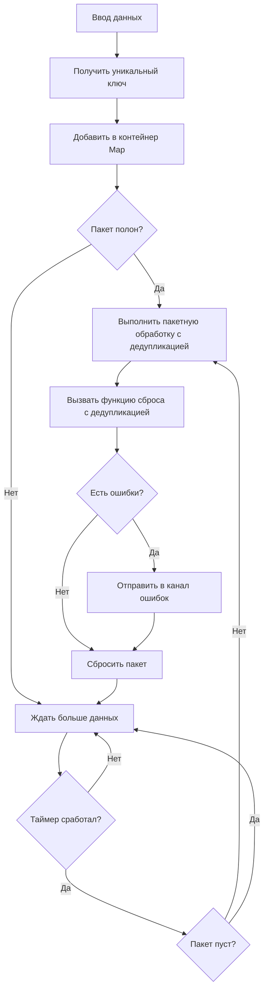

# Пайплайн дедупликации

DeduplicationPipeline является другим основным компонентом Go Pipeline v2, предоставляющим функциональность пакетной обработки с дедупликацией на основе уникальных ключей.

## Обзор

Пайплайн дедупликации автоматически удаляет дублированные данные во время пакетной обработки, основываясь на пользовательских функциях уникальных ключей для определения дублированных данных. Подходит для сценариев данных, требующих обработки дедупликации.

## Основные функции

- **Автоматическая дедупликация**: Автоматически удаляет дублированные данные на основе уникальных ключей
- **Гибкие функции ключей**: Поддерживает пользовательскую логику генерации уникальных ключей
- **Механизм пакетной обработки**: Поддерживает автоматическую пакетную обработку, запускаемую размером и временными интервалами
- **Безопасность конкурентности**: Встроенный механизм безопасности горутин
- **Обработка ошибок**: Комплексный сбор и распространение ошибок

## Поток данных



## Создание пайплайна дедупликации

### Использование конфигурации по умолчанию

```go
pipeline := gopipeline.NewDefaultDeduplicationPipeline(
    // Функция уникального ключа
    func(data User) string {
        return data.Email // Использовать email как уникальный ключ
    },
    // Функция пакетной обработки
    func(ctx context.Context, batchData []User) error {
        fmt.Printf("Обработка %d дедуплицированных пользователей\n", len(batchData))
        return nil
    },
)
```

### Использование пользовательской конфигурации

```go
deduplicationConfig := gopipeline.PipelineConfig{
    BufferSize:    200,                    // Размер буфера
    FlushSize:     50,                     // Размер пакета
    FlushInterval: time.Millisecond * 100, // Интервал сброса
}

pipeline := gopipeline.NewDeduplicationPipeline(deduplicationConfig,
    // Функция уникального ключа
    func(data Product) string {
        return fmt.Sprintf("%s-%s", data.SKU, data.Version)
    },
    // Функция пакетной обработки
    func(ctx context.Context, batchData []Product) error {
        return processProducts(batchData)
    },
)
```

## Примеры использования

### Пример дедупликации пользовательских данных

```go
package main

import (
    "context"
    "fmt"
    "log"
    "time"
    
    gopipeline "github.com/rushairer/go-pipeline/v2"
)

type User struct {
    ID    int
    Name  string
    Email string
}

func main() {
    // Создать пайплайн дедупликации, дедуплицировать на основе email
    pipeline := gopipeline.NewDefaultDeduplicationPipeline(
        func(user User) string {
            return user.Email // Email как уникальный ключ
        },
        func(ctx context.Context, users []User) error {
            fmt.Printf("Пакетная обработка %d дедуплицированных пользователей:\n", len(users))
            for _, user := range users {
                fmt.Printf("  - %s (%s)\n", user.Name, user.Email)
            }
            return nil
        },
    )
    
    ctx, cancel := context.WithTimeout(context.Background(), time.Second*5)
    defer cancel()
    
    // Запустить асинхронную обработку
    go func() {
        if err := pipeline.AsyncPerform(ctx); err != nil {
            log.Printf("Ошибка выполнения пайплайна: %v", err)
        }
    }()
    
    // Слушать ошибки
    errorChan := pipeline.ErrorChan(10)
    go func() {
        for err := range errorChan {
            log.Printf("Ошибка обработки: %v", err)
        }
    }()
    
    // Добавить данные (включая дублированные email)
    dataChan := pipeline.DataChan()
    users := []User{
        {ID: 1, Name: "Alice", Email: "alice@example.com"},
        {ID: 2, Name: "Bob", Email: "bob@example.com"},
        {ID: 3, Name: "Alice Updated", Email: "alice@example.com"}, // Дублированный email
        {ID: 4, Name: "Charlie", Email: "charlie@example.com"},
        {ID: 5, Name: "Bob Updated", Email: "bob@example.com"},     // Дублированный email
    }
    
    for _, user := range users {
        dataChan <- user
    }
    
    // Закрыть канал данных
    close(dataChan)
    
    // Дождаться завершения обработки
    time.Sleep(time.Second * 2)
}
```

### Пример дедупликации данных продуктов

```go
type Product struct {
    SKU     string
    Name    string
    Version string
    Price   float64
}

func productDeduplicationExample() {
    // Дедуплицировать на основе комбинации SKU+Version
    pipeline := gopipeline.NewDefaultDeduplicationPipeline(
        func(product Product) string {
            return fmt.Sprintf("%s-%s", product.SKU, product.Version)
        },
        func(ctx context.Context, products []Product) error {
            // Пакетное обновление информации о продуктах
            return updateProducts(products)
        },
    )
    
    // Использовать пайплайн...
}
```

### Пример дедупликации логов

```go
type LogEntry struct {
    Timestamp time.Time
    Level     string
    Message   string
    Source    string
}

func logDeduplicationExample() {
    // Дедуплицировать на основе содержимого сообщения и источника
    pipeline := gopipeline.NewDefaultDeduplicationPipeline(
        func(log LogEntry) string {
            return fmt.Sprintf("%s-%s", log.Message, log.Source)
        },
        func(ctx context.Context, logs []LogEntry) error {
            // Пакетная запись логов
            return writeLogsToStorage(logs)
        },
    )
    
    // Использовать пайплайн...
}
```

## Дизайн функции уникального ключа

### Простое поле как ключ

```go
// Использовать одно поле
func(user User) string {
    return user.Email
}
```

### Составные поля как ключ

```go
// Использовать комбинацию нескольких полей
func(order Order) string {
    return fmt.Sprintf("%s-%s-%d", 
        order.CustomerID, 
        order.ProductID, 
        order.Timestamp.Unix())
}
```

### Ключ сложной логики

```go
// Использовать сложную логику для генерации ключа
func(event Event) string {
    // Обработка нормализации
    normalized := strings.ToLower(strings.TrimSpace(event.Name))
    return fmt.Sprintf("%s-%s", normalized, event.Category)
}
```

### Хеш-ключ

```go
import (
    "crypto/md5"
    "fmt"
)

func(data ComplexData) string {
    // Генерировать хеш-ключ для сложных данных
    content := fmt.Sprintf("%v", data)
    hash := md5.Sum([]byte(content))
    return fmt.Sprintf("%x", hash)
}
```

## Стратегия дедупликации

### Сохранить последние данные

Пайплайн дедупликации по умолчанию сохраняет последние добавленные данные:

```go
// Если есть дублированные ключи, позже добавленные данные перезапишут ранее добавленные данные
dataChan <- User{ID: 1, Name: "Alice", Email: "alice@example.com"}
dataChan <- User{ID: 2, Name: "Alice Updated", Email: "alice@example.com"} // Это будет сохранено
```

### Пользовательская логика дедупликации

Если нужна более сложная логика дедупликации, она может быть реализована в функции пакетной обработки:

```go
func(ctx context.Context, users []User) error {
    // Пользовательская логика дедупликации: сохранить пользователя с наименьшим ID
    userMap := make(map[string]User)
    for _, user := range users {
        if existing, exists := userMap[user.Email]; !exists || user.ID < existing.ID {
            userMap[user.Email] = user
        }
    }
    
    // Преобразовать обратно в срез
    deduplicatedUsers := make([]User, 0, len(userMap))
    for _, user := range userMap {
        deduplicatedUsers = append(deduplicatedUsers, user)
    }
    
    return processUsers(deduplicatedUsers)
}
```

## Соображения производительности

### Использование памяти

Пайплайн дедупликации использует map для хранения данных, использование памяти связано с размером пакета:

```go
// Меньший размер пакета может уменьшить использование памяти
configОптимизированныйПоПамяти := gopipeline.PipelineConfig{
    BufferSize:    200,                   // Размер буфера
    FlushSize:     100,                   // Хранить максимум 100 уникальных элементов
    FlushInterval: time.Millisecond * 50, // Интервал сброса
}
```

### Производительность функции ключа

Убедитесь, что функция уникального ключа эффективна:

```go
// Хорошая практика: простой доступ к полю
func(user User) string {
    return user.ID
}

// Избегать: сложные вычисления
func(user User) string {
    // Избегать сложных вычислений в функции ключа
    return expensiveCalculation(user)
}
```

## Обработка ошибок

```go
// Слушать ошибки
errorChan := pipeline.ErrorChan(10)
go func() {
    for err := range errorChan {
        log.Printf("Ошибка пайплайна дедупликации: %v", err)
        
        // Можно обрабатывать на основе типа ошибки
        if isRetryableError(err) {
            // Логика повтора
        }
    }
}()
```

## Лучшие практики

1. **Выбрать подходящий уникальный ключ**: Убедиться, что ключ может точно идентифицировать уникальность данных
2. **Функция ключа должна быть эффективной**: Избегать сложных вычислений в функции ключа
3. **Мониторить использование памяти**: Большие пакеты могут вызвать высокое использование памяти
4. **Установить разумный размер пакета**: Балансировать использование памяти и эффективность обработки
5. **Быстро потреблять канал ошибок**: Предотвратить блокировку канала ошибок

## Сравнение со стандартным пайплайном

| Функция | Стандартный пайплайн | Пайплайн дедупликации |
|---------|----------------------|------------------------|
| Порядок данных | Сохраняет исходный порядок | Нет гарантии порядка |
| Использование памяти | Ниже | Выше (нужно хранить map) |
| Скорость обработки | Быстрее | Медленнее (нужны вычисления дедупликации) |
| Случаи использования | Общая пакетная обработка | Сценарии, требующие дедупликации |

## Следующие шаги

- [Руководство по конфигурации](./configuration) - Подробные инструкции по параметрам конфигурации
- [Справочник API](./api-reference) - Полная документация API
- [Стандартный пайплайн](./standard-pipeline) - Руководство по использованию стандартного пайплайна