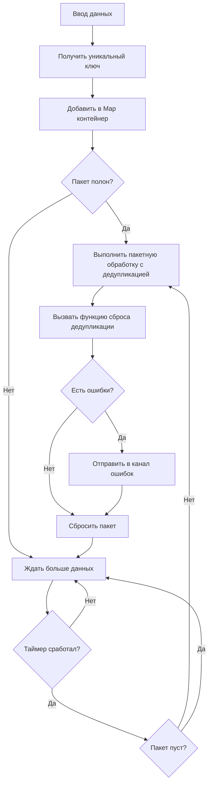

# Конвейер дедупликации

Конвейер дедупликации (DeduplicationPipeline) является еще одним основным компонентом Go Pipeline v2, предоставляющим функциональность пакетной обработки с дедупликацией на основе уникальных ключей.

## Обзор

Конвейер дедупликации автоматически удаляет дублирующиеся данные во время пакетной обработки, основываясь на методе `GetKey()` интерфейса `UniqueKeyData`, реализованного типом данных, для определения дублирования данных. Подходит для сценариев данных, которые требуют обработки дедупликации.

## Основные функции

- **Автоматическая дедупликация**: Автоматически удаляет дублирующиеся данные на основе уникальных ключей
- **Ограничения интерфейса**: Обеспечивает типобезопасную генерацию уникальных ключей через интерфейс `UniqueKeyData`
- **Пакетная обработка**: Поддерживает автоматический запуск пакетов по размеру и временному интервалу
- **Безопасность параллелизма**: Встроенные механизмы безопасности горутин
- **Обработка ошибок**: Комплексный сбор и распространение ошибок

## Поток данных


```mermaid
graph TD
    A["Ввод данных"] --> B["Получить уникальный ключ"]
    B --> C["Добавить в Map контейнер"]
    C --> D{"Пакет полон?"}
    D -->|Да| E["Выполнить пакетную обработку с дедупликацией"]
    D -->|Нет| F["Ждать больше данных"]
    F --> G{"Таймер сработал?"}
    G -->|Да| H{"Пакет пуст?"}
    H -->|Нет| E
    H -->|Да| F
    G -->|Нет| F
    E --> I["Вызвать функцию сброса дедупликации"]
    I --> J{"Есть ошибки?"}
    J -->|Да| K["Отправить в канал ошибок"]
    J -->|Нет| L["Сбросить пакет"]
    K --> L
    L --> F
```

## Создание конвейера дедупликации

### Использование конфигурации по умолчанию

```go
// Определить структуру данных, реализующую интерфейс UniqueKeyData
type User struct {
    ID    int
    Name  string
    Email string
}

func (u User) GetKey() string {
    return u.Email
}

pipeline := gopipeline.NewDefaultDeduplicationPipeline(
    func(ctx context.Context, batchData map[string]User) error {
        fmt.Printf("Обработка %d дедуплицированных пользователей\n", len(batchData))
        for key, user := range batchData {
            fmt.Printf("  %s: %s\n", key, user.Name)
        }
        return nil
    },
)
```

### Использование пользовательской конфигурации

```go
type Product struct {
    SKU     string
    Name    string
    Version string
    Price   float64
}

func (p Product) GetKey() string {
    return fmt.Sprintf("%s-%s", p.SKU, p.Version)
}

deduplicationConfig := gopipeline.NewPipelineConfig().
    WithBufferSize(200).
    WithFlushSize(50).
    WithFlushInterval(time.Millisecond * 100).
    WithDrainOnCancel(true)

pipeline := gopipeline.NewDeduplicationPipeline(deduplicationConfig,
    func(ctx context.Context, batchData map[string]Product) error {
        return processProducts(batchData)
    },
)
```

## Примеры использования

### Пример дедупликации пользовательских данных

```go
package main

import (
    "context"
    "fmt"
    "log"
    "time"
    
    gopipeline "github.com/rushairer/go-pipeline/v2"
)

type User struct {
    ID    int
    Name  string
    Email string
}

func (u User) GetKey() string {
    return u.Email
}

func main() {
    // Создать конвейер дедупликации
    pipeline := gopipeline.NewDefaultDeduplicationPipeline(
        func(ctx context.Context, users map[string]User) error {
            fmt.Printf("Пакетная обработка %d дедуплицированных пользователей:\n", len(users))
            for key, user := range users {
                fmt.Printf("  - %s: %s (%s)\n", key, user.Name, user.Email)
            }
            return nil
        },
    )
    
    ctx, cancel := context.WithTimeout(context.Background(), time.Second*5)
    defer cancel()
    
    // Запуск с использованием удобного API
    done, errs := pipeline.Start(ctx)
    
    // Прослушивание ошибок
    go func() {
        for err := range errs {
            log.Printf("Ошибка обработки: %v", err)
        }
    }()
    
    // Добавление данных (включая дублирующиеся email)
    dataChan := pipeline.DataChan()
    go func() {
        defer close(dataChan) // Кто пишет, тот закрывает
        
        users := []User{
            {ID: 1, Name: "Alice", Email: "alice@example.com"},
            {ID: 2, Name: "Bob", Email: "bob@example.com"},
            {ID: 3, Name: "Alice Updated", Email: "alice@example.com"}, // Дублирующийся email, перезапишет первый
            {ID: 4, Name: "Charlie", Email: "charlie@example.com"},
            {ID: 5, Name: "Bob Updated", Email: "bob@example.com"},     // Дублирующийся email, перезапишет первый
        }
        
        for _, user := range users {
            select {
            case dataChan <- user:
            case <-ctx.Done():
                return
            }
        }
    }()
    
    // Ожидание завершения
    <-done
}
```

### Пример дедупликации данных продуктов

```go
type Product struct {
    SKU     string
    Name    string
    Version string
    Price   float64
}

func (p Product) GetKey() string {
    return fmt.Sprintf("%s-%s", p.SKU, p.Version)
}

func productDeduplicationExample() {
    // Дедупликация на основе комбинации SKU+Version
    pipeline := gopipeline.NewDefaultDeduplicationPipeline(
        func(ctx context.Context, products map[string]Product) error {
            // Пакетное обновление информации о продуктах
            return updateProducts(products)
        },
    )
    
    // Использовать конвейер...
}
```

### Пример дедупликации логов

```go
type LogEntry struct {
    Timestamp time.Time
    Level     string
    Message   string
    Source    string
}

func (l LogEntry) GetKey() string {
    return fmt.Sprintf("%s-%s", l.Message, l.Source)
}

func logDeduplicationExample() {
    // Дедупликация на основе содержимого сообщения и источника
    pipeline := gopipeline.NewDefaultDeduplicationPipeline(
        func(ctx context.Context, logs map[string]LogEntry) error {
            // Пакетная запись логов
            return writeLogsToStorage(logs)
        },
    )
    
    // Использовать конвейер...
}
```

## Дизайн функции уникального ключа

### Простое поле как ключ

```go
// Использовать одно поле
func (user User) GetKey() string {
    return user.Email
}
```

### Комбинированные поля как ключ

```go
// Использовать комбинацию нескольких полей
func (order Order) GetKey() string {
    return fmt.Sprintf("%s-%s-%d", 
        order.CustomerID, 
        order.ProductID, 
        order.Timestamp.Unix())
}
```

### Ключ со сложной логикой

```go
// Использовать сложную логику для генерации ключа
func (event Event) GetKey() string {
    // Обработка нормализации
    normalized := strings.ToLower(strings.TrimSpace(event.Name))
    return fmt.Sprintf("%s-%s", normalized, event.Category)
}
```

### Хеш-ключ

```go
import (
    "crypto/md5"
    "fmt"
)

func (data ComplexData) GetKey() string {
    // Генерировать хеш-ключ для сложных данных
    content := fmt.Sprintf("%v", data)
    hash := md5.Sum([]byte(content))
    return fmt.Sprintf("%x", hash)
}
```

## Стратегия дедупликации

### Сохранение последних данных

Конвейер дедупликации по умолчанию сохраняет последние добавленные данные:

```go
// Если есть дублирующиеся ключи, позже добавленные данные перезапишут ранее добавленные данные
dataChan <- User{ID: 1, Name: "Alice", Email: "alice@example.com"}
dataChan <- User{ID: 2, Name: "Alice Updated", Email: "alice@example.com"} // Этот будет сохранен
```

### Пользовательская логика дедупликации

Если нужна более сложная логика дедупликации, она может быть реализована в функции пакетной обработки:

```go
func(ctx context.Context, users map[string]User) error {
    // Пользовательская логика дедупликации: сохранить пользователя с наименьшим ID
    userMap := make(map[string]User)
    for _, user := range users {
        if existing, exists := userMap[user.Email]; !exists || user.ID < existing.ID {
            userMap[user.Email] = user
        }
    }
    
    // Преобразовать обратно в срез
    deduplicatedUsers := make([]User, 0, len(userMap))
    for _, user := range userMap {
        deduplicatedUsers = append(deduplicatedUsers, user)
    }
    
    return processUsers(deduplicatedUsers)
}
```

## Соображения производительности

### Использование памяти

Конвейер дедупликации использует map для хранения данных, использование памяти связано с размером пакета:

```go
// Меньший размер пакета может уменьшить использование памяти
memoryOptimizedConfig := gopipeline.PipelineConfig{
    BufferSize:    200,                   // Размер буфера
    FlushSize:     100,                   // Хранить максимум 100 уникальных элементов
    FlushInterval: time.Millisecond * 50, // Интервал сброса
}
```

### Производительность функции ключа

Убедитесь, что функция уникального ключа эффективна:

```go
// Хорошая практика: простой доступ к полю
func (user User) GetKey() string {
    return user.ID
}

// Избегать: сложные вычисления
func (user User) GetKey() string {
    // Избегать сложных вычислений в функции ключа
    return expensiveCalculation(user)
}
```

## Обработка ошибок

```go
// Прослушивать ошибки
errorChan := pipeline.ErrorChan(10)
go func() {
    for err := range errorChan {
        log.Printf("Ошибка конвейера дедупликации: %v", err)
        
        // Обрабатывать в зависимости от типа ошибки
        if isRetryableError(err) {
            // Логика повтора
        }
    }
}()
```

## Лучшие практики

1. **Выбрать подходящий уникальный ключ**: Убедиться, что ключ может точно идентифицировать уникальность данных
2. **Функция ключа должна быть эффективной**: Избегать сложных вычислений в функциях ключа
3. **Мониторить использование памяти**: Большие пакеты могут привести к высокому использованию памяти
4. **Установить разумный размер пакета**: Балансировать использование памяти и эффективность обработки
5. **Своевременно потреблять канал ошибок**: Предотвращать блокировку канала ошибок

## Сравнение со стандартным конвейером

| Функция | Стандартный конвейер | Конвейер дедупликации |
|---------|----------------------|-----------------------|
| Порядок данных | Сохраняет исходный порядок | Нет гарантии порядка |
| Использование памяти | Ниже | Выше (нужно хранить map) |
| Скорость обработки | Быстрее | Медленнее (нужны вычисления дедупликации) |
| Случаи использования | Общая пакетная обработка | Сценарии, требующие дедупликации |

## Следующие шаги

- [Руководство по конфигурации](./configuration) - Подробные описания параметров конфигурации
- [Справочник API](./api-reference) - Полная документация API
- [Стандартный конвейер](./standard-pipeline) - Руководство по использованию стандартного конвейера