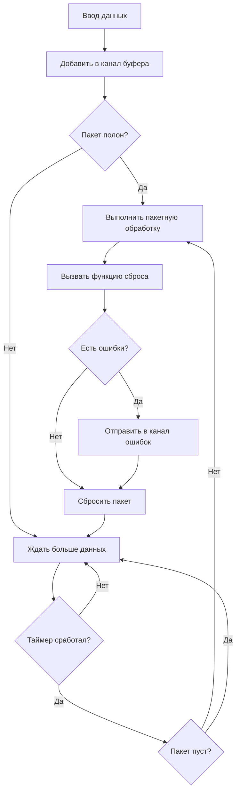

# Стандартный пайплайн

StandardPipeline является одним из основных компонентов Go Pipeline v2, предоставляющим функциональность последовательной пакетной обработки данных.

## Обзор

Стандартный пайплайн обрабатывает входные данные пакетами согласно настроенному размеру пакета и временным интервалам, подходит для сценариев, которые требуют сохранения порядка данных.

## Основные функции

- **Последовательная обработка**: Данные обрабатываются пакетами в том порядке, в котором они были добавлены
- **Автоматическая пакетная обработка**: Поддерживает автоматическую пакетную обработку, запускаемую размером и временными интервалами
- **Безопасность конкурентности**: Встроенный механизм безопасности горутин
- **Обработка ошибок**: Комплексный сбор и распространение ошибок

## Поток данных



## Создание стандартного пайплайна

### Использование конфигурации по умолчанию

```go
pipeline := gopipeline.NewDefaultStandardPipeline(
    func(ctx context.Context, batchData []string) error {
        // Обработать пакетные данные
        fmt.Printf("Обработка %d элементов: %v\n", len(batchData), batchData)
        return nil
    },
)
```

### Использование пользовательской конфигурации

```go
customConfig := gopipeline.PipelineConfig{
    BufferSize:    200,                    // Размер буфера
    FlushSize:     100,                    // Размер пакета
    FlushInterval: time.Millisecond * 100, // Интервал сброса
}

pipeline := gopipeline.NewStandardPipeline(customConfig,
    func(ctx context.Context, batchData []string) error {
        // Обработать пакетные данные
        return processData(batchData)
    },
)
```

## Примеры использования

### Базовое использование

```go
package main

import (
    "context"
    "fmt"
    "log"
    "time"
    
    gopipeline "github.com/rushairer/go-pipeline/v2"
)

func main() {
    // Создать пайплайн
    pipeline := gopipeline.NewDefaultStandardPipeline(
        func(ctx context.Context, batchData []string) error {
            fmt.Printf("Пакетная обработка %d элементов: %v\n", len(batchData), batchData)
            // Симулировать время обработки
            time.Sleep(time.Millisecond * 10)
            return nil
        },
    )
    
    ctx, cancel := context.WithTimeout(context.Background(), time.Second*5)
    defer cancel()
    
    // Запустить асинхронную обработку
    go func() {
        if err := pipeline.AsyncPerform(ctx); err != nil {
            log.Printf("Ошибка выполнения пайплайна: %v", err)
        }
    }()
    
    // Слушать ошибки
    errorChan := pipeline.ErrorChan(10)
    go func() {
        for err := range errorChan {
            log.Printf("Ошибка обработки: %v", err)
        }
    }()
    
    // Добавить данные
    dataChan := pipeline.DataChan()
    for i := 0; i < 200; i++ {
        dataChan <- fmt.Sprintf("data-%d", i)
    }
    
    // Закрыть канал данных
    close(dataChan)
    
    // Дождаться завершения обработки
    time.Sleep(time.Second * 2)
}
```

### Пример пакетной вставки в базу данных

```go
func batchInsertExample() {
    // Создать пайплайн пакетной вставки в базу данных
    pipeline := gopipeline.NewDefaultStandardPipeline(
        func(ctx context.Context, users []User) error {
            // Пакетная вставка в базу данных
            return db.CreateInBatches(users, len(users)).Error
        },
    )
    
    ctx := context.Background()
    
    // Запустить пайплайн
    go pipeline.AsyncPerform(ctx)
    
    // Обработка ошибок
    go func() {
        for err := range pipeline.ErrorChan(10) {
            log.Printf("Ошибка вставки в базу данных: %v", err)
        }
    }()
    
    // Добавить пользовательские данные
    dataChan := pipeline.DataChan()
    for i := 0; i < 1000; i++ {
        user := User{
            Name:  fmt.Sprintf("user-%d", i),
            Email: fmt.Sprintf("user%d@example.com", i),
        }
        dataChan <- user
    }
    
    close(dataChan)
}
```

### Пример пакетной обработки API-вызовов

```go
func apiCallExample() {
    pipeline := gopipeline.NewStandardPipeline(
        gopipeline.PipelineConfig{
            FlushSize:     20,                     // 20 элементов на вызов
            FlushInterval: time.Millisecond * 200, // Интервал 200ms
        },
        func(ctx context.Context, requests []APIRequest) error {
            // Пакетный вызов API
            return batchCallAPI(requests)
        },
    )
    
    // Использовать пайплайн...
}
```

## Синхронное vs Асинхронное выполнение

### Асинхронное выполнение (рекомендуется)

```go
// Асинхронное выполнение, не блокирует основной поток
go func() {
    if err := pipeline.AsyncPerform(ctx); err != nil {
        log.Printf("Ошибка выполнения пайплайна: %v", err)
    }
}()
```

### Синхронное выполнение

```go
// Синхронное выполнение, блокирует до завершения или отмены
if err := pipeline.SyncPerform(ctx); err != nil {
    log.Printf("Ошибка выполнения пайплайна: %v", err)
}
```

## Обработка ошибок

Стандартный пайплайн предоставляет комплексный механизм обработки ошибок:

```go
// Создать канал ошибок
errorChan := pipeline.ErrorChan(100) // Размер буфера 100

// Слушать ошибки
go func() {
    for err := range errorChan {
        // Обработать ошибки
        log.Printf("Ошибка пакетной обработки: %v", err)
        
        // Можно обрабатывать разные типы ошибок по-разному
        switch e := err.(type) {
        case *DatabaseError:
            // Обработка ошибки базы данных
        case *NetworkError:
            // Обработка сетевой ошибки
        default:
            // Обработка других ошибок
        }
    }
}()
```

## Рекомендации по оптимизации производительности

### 1. Установить разумный размер пакета

```go
// Настроить размер пакета согласно производительности обработки
batchSizeConfig := gopipeline.PipelineConfig{
    BufferSize:    200,                   // Размер буфера
    FlushSize:     100,                   // Большие пакеты могут улучшить пропускную способность
    FlushInterval: time.Millisecond * 50, // Стандартный интервал
}
```

### 2. Настроить размер буфера

```go
// Буфер должен быть как минимум в 2 раза больше размера пакета
bufferSizeConfig := gopipeline.PipelineConfig{
    BufferSize:    200,                   // FlushSize * 2
    FlushSize:     100,                   // Размер пакета
    FlushInterval: time.Millisecond * 50, // Стандартный интервал
}
```

### 3. Оптимизировать интервал сброса

```go
// Настроить интервал согласно требованиям задержки
// Конфигурация низкой задержки
configНизкойЗадержки := gopipeline.PipelineConfig{
    BufferSize:    100,                   // Умеренный буфер
    FlushSize:     50,                    // Умеренный пакет
    FlushInterval: time.Millisecond * 50, // Низкая задержка
}

// Конфигурация высокой пропускной способности
configВысокойПропускнойСпособности := gopipeline.PipelineConfig{
    BufferSize:    400,       // Большой буфер
    FlushSize:     200,       // Большой пакет
    FlushInterval: time.Second, // Высокая пропускная способность
}
```

## Лучшие практики

1. **Быстро потреблять канал ошибок**: Должна быть горутина, потребляющая канал ошибок, иначе может вызвать блокировку
2. **Правильно закрывать каналы**: Использовать принцип "писатель закрывает" для управления жизненным циклом каналов
3. **Устанавливать разумные таймауты**: Использовать контекст для контроля времени выполнения пайплайна
4. **Мониторить производительность**: Настраивать параметры конфигурации согласно реальным сценариям

## Следующие шаги

- [Пайплайн дедупликации](./deduplication-pipeline) - Изучить пайплайн пакетной обработки с дедупликацией
- [Руководство по конфигурации](./configuration) - Подробные инструкции по параметрам конфигурации
- [Справочник API](./api-reference) - Полная документация API