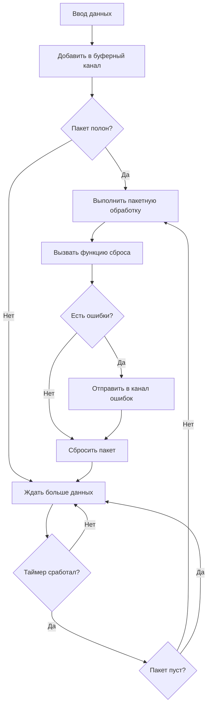

# Стандартный конвейер

Стандартный конвейер (StandardPipeline) является одним из основных компонентов Go Pipeline v2, предоставляющим функциональность последовательной пакетной обработки.

## Обзор

Стандартный конвейер обрабатывает входные данные пакетами в соответствии с настроенным размером пакета и временными интервалами, подходит для сценариев, которые требуют сохранения порядка данных.

## Основные функции

- **Последовательная обработка**: Данные обрабатываются пакетами в порядке их добавления
- **Автоматическая пакетная обработка**: Поддерживает автоматический запуск пакетов по размеру и временному интервалу
- **Безопасность параллелизма**: Встроенные механизмы безопасности горутин
- **Обработка ошибок**: Комплексный сбор и распространение ошибок

## Поток данных


```mermaid
graph TD
    A["Ввод данных"] --> B["Добавить в буферный канал"]
    B --> C{"Пакет полон?"}
    C -->|Да| D["Выполнить пакетную обработку"]
    C -->|Нет| E["Ждать больше данных"]
    E --> F{"Таймер сработал?"}
    F -->|Да| G{"Пакет пуст?"}
    G -->|Нет| D
    G -->|Да| E
    F -->|Нет| E
    D --> H["Вызвать функцию сброса"]
    H --> I{"Есть ошибки?"}
    I -->|Да| J["Отправить в канал ошибок"]
    I -->|Нет| K["Сбросить пакет"]
    J --> K
    K --> E
```

## Создание стандартного конвейера

### Использование конфигурации по умолчанию

```go
pipeline := gopipeline.NewDefaultStandardPipeline(
    func(ctx context.Context, batchData []string) error {
        // Обработать пакетные данные
        fmt.Printf("Обработка %d элементов: %v\n", len(batchData), batchData)
        return nil
    },
)
```

### Использование пользовательской конфигурации

```go
// Создать конфигурацию с использованием цепочечных методов
customConfig := gopipeline.NewPipelineConfig().
    WithBufferSize(200).
    WithFlushSize(100).
    WithFlushInterval(time.Millisecond * 100).
    WithDrainOnCancel(true).
    WithDrainGracePeriod(150 * time.Millisecond)

pipeline := gopipeline.NewStandardPipeline(customConfig,
    func(ctx context.Context, batchData []string) error {
        // Обработать пакетные данные
        return processData(batchData)
    },
)
```

## Примеры использования

### Использование удобного API (Рекомендуется)

```go
package main

import (
    "context"
    "fmt"
    "log"
    "time"
    
    gopipeline "github.com/rushairer/go-pipeline/v2"
)

func main() {
    // Создать конвейер
    pipeline := gopipeline.NewDefaultStandardPipeline(
        func(ctx context.Context, batchData []string) error {
            fmt.Printf("Пакетная обработка %d элементов: %v\n", len(batchData), batchData)
            // Имитировать время обработки
            time.Sleep(time.Millisecond * 10)
            return nil
        },
    )
    
    ctx, cancel := context.WithTimeout(context.Background(), time.Second*5)
    defer cancel()
    
    // Запуск с использованием удобного API
    done, errs := pipeline.Start(ctx)
    
    // Прослушивание ошибок
    go func() {
        for err := range errs {
            log.Printf("Ошибка обработки: %v", err)
        }
    }()
    
    // Добавление данных
    dataChan := pipeline.DataChan()
    go func() {
        defer close(dataChan) // Кто пишет, тот закрывает
        for i := 0; i < 200; i++ {
            select {
            case dataChan <- fmt.Sprintf("data-%d", i):
            case <-ctx.Done():
                return
            }
        }
    }()
    
    // Ожидание завершения
    <-done
}
```

### Пример синхронного выполнения

```go
func syncExample() {
    pipeline := gopipeline.NewDefaultStandardPipeline(
        func(ctx context.Context, batchData []string) error {
            fmt.Printf("Пакетная обработка %d элементов: %v\n", len(batchData), batchData)
            return nil
        },
    )
    
    ctx, cancel := context.WithTimeout(context.Background(), time.Second*5)
    defer cancel()
    
    // Синхронный запуск, установить емкость канала ошибок в 128
    if err := pipeline.Run(ctx, 128); err != nil {
        log.Printf("Ошибка выполнения конвейера: %v", err)
    }
}
```

### Пример пакетной вставки в базу данных

```go
func batchInsertExample() {
    // Создать конвейер пакетной вставки в базу данных
    pipeline := gopipeline.NewDefaultStandardPipeline(
        func(ctx context.Context, users []User) error {
            // Пакетная вставка в базу данных
            return db.CreateInBatches(users, len(users)).Error
        },
    )
    
    ctx := context.Background()
    
    // Запустить конвейер
    go pipeline.AsyncPerform(ctx)
    
    // Обработка ошибок
    go func() {
        for err := range pipeline.ErrorChan(10) {
            log.Printf("Ошибка вставки в базу данных: %v", err)
        }
    }()
    
    // Добавить пользовательские данные
    dataChan := pipeline.DataChan()
    for i := 0; i < 1000; i++ {
        user := User{
            Name:  fmt.Sprintf("user-%d", i),
            Email: fmt.Sprintf("user%d@example.com", i),
        }
        dataChan <- user
    }
    
    close(dataChan)
}
```

### Пример пакетной обработки API-вызовов

```go
func apiCallExample() {
    pipeline := gopipeline.NewStandardPipeline(
        gopipeline.PipelineConfig{
            FlushSize:     20,                     // 20 элементов за вызов
            FlushInterval: time.Millisecond * 200, // Интервал 200мс
        },
        func(ctx context.Context, requests []APIRequest) error {
            // Пакетный вызов API
            return batchCallAPI(requests)
        },
    )
    
    // Использовать конвейер...
}
```

## Удобный API против традиционного API

### Удобный API (Рекомендуется)

Новый удобный API добавлен в v2.2.2 для уменьшения шаблонного кода:

```go
// Асинхронный запуск
done, errs := pipeline.Start(ctx)
go func() {
    for err := range errs {
        log.Printf("Ошибка: %v", err)
    }
}()
<-done // Ждать завершения

// Синхронный запуск
if err := pipeline.Run(ctx, 128); err != nil {
    log.Printf("Ошибка выполнения конвейера: %v", err)
}
```

### Традиционный API

```go
// Асинхронное выполнение
go func() {
    if err := pipeline.AsyncPerform(ctx); err != nil {
        log.Printf("Ошибка выполнения конвейера: %v", err)
    }
}()

// Синхронное выполнение
if err := pipeline.SyncPerform(ctx); err != nil {
    log.Printf("Ошибка выполнения конвейера: %v", err)
}
```

## Динамическая настройка параметров

v2.2.2 поддерживает безопасную настройку ключевых параметров во время выполнения:

```go
// Настройка параметров во время выполнения
pipeline.UpdateFlushSize(128)
pipeline.UpdateFlushInterval(25 * time.Millisecond)

// Пример: Динамическая настройка на основе системной нагрузки
go func() {
    ticker := time.NewTicker(time.Second * 30)
    defer ticker.Stop()
    
    for range ticker.C {
        load := getSystemLoad()
        if load > 0.8 {
            // Уменьшить размер пакета при высокой нагрузке
            pipeline.UpdateFlushSize(25)
            pipeline.UpdateFlushInterval(100 * time.Millisecond)
        } else {
            // Использовать стандартную конфигурацию при нормальной нагрузке
            pipeline.UpdateFlushSize(50)
            pipeline.UpdateFlushInterval(50 * time.Millisecond)
        }
    }
}()
```

## Обработка ошибок

Стандартный конвейер предоставляет комплексные механизмы обработки ошибок:

```go
// Создать канал ошибок
errorChan := pipeline.ErrorChan(100) // Размер буфера 100

// Прослушивать ошибки
go func() {
    for err := range errorChan {
        // Обработать ошибки
        log.Printf("Ошибка пакетной обработки: %v", err)
        
        // Различная обработка в зависимости от типа ошибки
        switch e := err.(type) {
        case *DatabaseError:
            // Обработка ошибок базы данных
        case *NetworkError:
            // Обработка сетевых ошибок
        default:
            // Обработка других ошибок
        }
    }
}()
```

## Рекомендации по оптимизации производительности

### 1. Установить подходящий размер пакета

```go
// Настроить размер пакета в зависимости от производительности обработки
batchSizeConfig := gopipeline.PipelineConfig{
    BufferSize:    200,                   // Размер буфера
    FlushSize:     100,                   // Большие пакеты могут улучшить пропускную способность
    FlushInterval: time.Millisecond * 50, // Стандартный интервал
}
```

### 2. Настроить размер буфера

```go
// Буфер должен быть как минимум в 2 раза больше размера пакета
bufferSizeConfig := gopipeline.PipelineConfig{
    BufferSize:    200,                   // FlushSize * 2
    FlushSize:     100,                   // Размер пакета
    FlushInterval: time.Millisecond * 50, // Стандартный интервал
}
```

### 3. Оптимизировать интервал сброса

```go
// Настроить интервал в зависимости от требований к задержке
// Конфигурация низкой задержки
lowLatencyConfig := gopipeline.PipelineConfig{
    BufferSize:    100,                   // Умеренный буфер
    FlushSize:     50,                    // Умеренный пакет
    FlushInterval: time.Millisecond * 50, // Низкая задержка
}

// Конфигурация высокой пропускной способности
highThroughputConfig := gopipeline.PipelineConfig{
    BufferSize:    400,       // Большой буфер
    FlushSize:     200,       // Большой пакет
    FlushInterval: time.Second, // Высокая пропускная способность
}
```

## Лучшие практики

1. **Своевременно потреблять канал ошибок**: Должна быть горутина, потребляющая канал ошибок, иначе может возникнуть блокировка
2. **Правильно закрывать каналы**: Использовать принцип "кто пишет, тот закрывает" для управления жизненным циклом каналов
3. **Устанавливать разумные таймауты**: Использовать контекст для управления временем выполнения конвейера
4. **Мониторить производительность**: Настраивать параметры конфигурации в зависимости от реальных сценариев

## Следующие шаги

- [Конвейер дедупликации](./deduplication-pipeline) - Изучить конвейеры пакетной обработки с дедупликацией
- [Руководство по конфигурации](./configuration) - Подробные описания параметров конфигурации
- [Справочник API](./api-reference) - Полная документация API